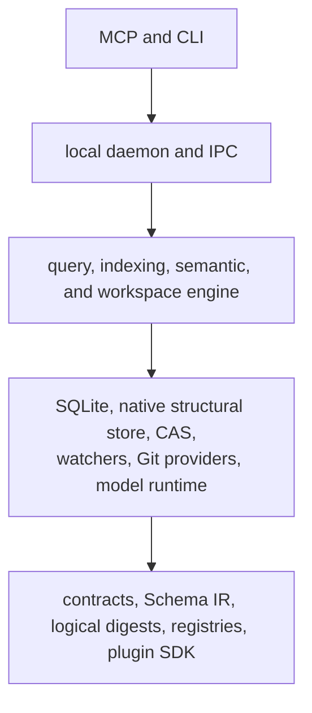

# Urdira

Urdira is a local, open-source code-intelligence engine for coding agents. It
indexes an explicitly selected workspace, keeps the index synchronized with the
working tree, and exposes deterministic structural, lexical, semantic, and
change-impact queries through MCP.

Urdira is a read-only intelligence layer. It does not edit source files, apply
patches, run shell commands, build projects, or infer repository scope from a
connection or current directory.

## Why Urdira

Coding agents often spend several turns finding a definition, its callers,
related tests, source context, and likely change impact. Urdira keeps those
facts in one snapshot-aware model so an agent can request a bounded context
package or compose dependent queries without repeatedly scanning the
repository.

Core properties:

- explicit workspace and snapshot scope on every source-reading request;
- immutable snapshots and persistent cursors, including after daemon restart;
- exact owner artifact, version, source span, evidence, and completeness data;
- near-real-time working-tree updates backed by authoritative reconciliation;
- changed-file watcher updates use a safe targeted capture when possible, with
  complete reconciliation retained as a fallback only for lost or ambiguous
  events;
- macOS workspace watchers prefer `kqueue` for small workspaces and switch to
  `fs-events` above the 2,000-file watch budget to avoid exhausting file descriptors;
- registered physical delete events are applied directly; renames publish the
  absence and new presence in consecutive generations;
- deterministic ordering with no hidden approximate fallback;
- concurrent workspaces, Git worktrees, detached checkouts, clones, ordinary
  directories, and read-only Git references; and
- a language-neutral core with a bundled JavaScript/TypeScript analyzer.

The bundled `urdira:javascript_typescript` plugin supports JavaScript,
TypeScript, JSX, TSX, and the surrounding module/type relationships. Other
languages require a compatible plugin. Without a structural plugin, source
catalog, text retrieval, snapshot, freshness, and index-status capabilities
remain available; unsupported operations fail explicitly.

### Context an agent can use directly

`urdira_context` combines explicitly requested structural neighborhoods with
source selected by `options.snippets`. Client-selected `response_budget` and
source projection options govern each page; logical results are not discarded
to make responses small. Exact or overlapping source ranges from the same
artifact version are coalesced into one continuous local source and share
references, while distinct source, record provenance, coverage and
continuations remain visible. Large queries are legitimately large and pageable. When a complete
page cannot fit, Urdira returns an explicit budget error instead of silently
removing results. Semantic analogues require the semantic retrieval surface;
the structural context route reports that capability boundary explicitly.
If a request enlarges source hydration but omits `response_budget.max_characters`,
the MCP adapter derives a larger default ceiling from that explicit projection.
Supplying `max_characters` keeps the client's value unchanged.

When those options are omitted, `urdira_context` uses a task-oriented source
window (6,000 characters per snippet, 30,000 source characters, 20 surrounding
lines, and a 40,000-character response page). These are public replaceable
defaults. Relevant windows are clipped around the requested declaration so
leading context cannot push the requested symbol out of the snippet. When the
same declaration exists in typed source and JavaScript output, typed source is
ordered first while both results remain pageable.

For the `tests` facet, indexed `covers` relationships remain confirmed
evidence. Exact identifier occurrences in test-shaped artifacts supplement
missing graph relationships as possible evidence. Their source windows are
hydrated from the smallest indexed callable that contains the occurrence when
one exists, so the initial context can include the complete executable test
body without weakening the structural classification. The prompt hook uses the
public 50-item response default within its replaceable 40,000-character page
budget; clients can override both values.

Agents should start with the returned locations, code and evidence, request
further Urdira context when needed, and avoid re-reading the same information
through shell. Editing, tests, builds and Git remain host operations. Index
coverage, page coverage and source-projection truncation are separate signals.
An empty search is not missing coverage: agents should try related indexed
terms, locate artifacts and request source through Urdira before using native
discovery for a concrete retrieval failure or unsupported capability. The Codex
installer includes this guidance once in the additive `developer_instructions`
configuration, preserving existing user instructions and leaving the host base
instructions intact. It preserves a user-owned `~/.codex/AGENTS.md` and removes
the older duplicated Urdira block during an upgrade. In Codex code mode the
guidance names the deferred `tools.mcp__urdira__*` callables explicitly, so the
agent does not spend a model round discovering them through `ALL_TOOLS`.

## Install

Urdira 0.3.3 requires Node.js `>=24.18.1`. The dependency-free 0.3.3 bootstrap
prepares the exact `@urdira/runtime@0.3.3` application. Confirmed runtime preparation also
requires npm `>=11.16.0`, which supplies the strict install-script policy. Check
with `npm --version`; if necessary, update the npm paired with the active Node
installation before preparing the runtime:

```bash
npm install --global npm@11.16.0
```

Install the dependency-free bootstrap:

```bash
npm install --global urdira
urdira --version
urdira --help
```

The bootstrap has no npm dependency closure, so the global installation does
not trigger native lifecycle scripts or transitive deprecation warnings.
Before the first real CLI or MCP command, review and prepare the exact matching
runtime:

```bash
urdira runtime prepare --dry-run
urdira runtime prepare --confirm
```

The dry-run names the target directory, fixed npm registry, exact runtime and
minimum npm versions, and the reviewed install scripts for ONNX Runtime, Sharp, Parcel
Watcher, and protobuf. It also discloses the current upstream
`boolean@3.2.0` deprecation inherited by Transformers.js. Preparation captures
that acknowledged npm notice, rejects any new warning, validates the installed
runtime, and activates it atomically. An interactive terminal offers the same
confirmation before its first runtime command; non-interactive and MCP starts
never install anything implicitly.

The same dry-run inspects only the data-root catalog contract. When it detects
a pre-v3 root, it names that exact root and states that confirmed preparation
will permanently remove it. `--confirm` refuses to continue while a daemon
still owns the root, stages and validates the replacement runtime first, then
deletes the complete legacy root and activates a clean v3 runtime. A valid v3
root is never reset by runtime preparation. Because v3 has no compatibility
reader or in-place migration, workspaces from a removed pre-v3 root must be
registered and indexed again.

The first confirmed configuration that enables semantic search may download
the declared open embedding model. The CLI reports that action. Urdira does
not download models during startup, indexing, query execution, pagination, or
replay.

A newly registered workspace is indexed with the v4 structural store by
default: a native, immutable segment store plus a small SQLite catalog file,
its enabled lexical and semantic sidecar databases, and a `.structural/`/`.sidecar/`
directory pair, all siblings of the workspace's data file under the data
root (see [`docs/README.md`](docs/README.md) and
[v4 structural store](docs/decisions/26-v4-structural-store.md)). Set
`URDIRA_V4=0` before registering a workspace to opt it into the v3 SQLite
pipeline described below instead; this opt-out is intended for one release.
Neither format is migrated into the other automatically -- a workspace keeps
whichever format it was created with until it is removed and re-added.
Hot-file writes are serialized per file so adjacent partitions cannot race on
shared filesystem blocks. Encoding, hashing and writes to separate files remain
parallel. Integrity errors remain explicit; published data is never silently
repaired by changing its checksum.

## Current state: v4 default, v3 legacy

A newly registered workspace uses the v4 structural store described above by
default. v4 adds, over the v3 pipeline documented later in this file:

- **Reconcile scans.** A git checkout/pull/branch switch, or a watcher event
  the daemon cannot safely interpret as an exact changed-file list, triggers
  a `reconcile` scan instead of a guessed incremental one. Reconcile always
  re-derives the true delta from one authoritative walk, treats a
  content-identical file (same hash, stale mtime) as a no-op, and republishes
  through the cheaper delta pipeline when the delta touches at most 1% of the
  workspace (`RECONCILE_DELTA_THRESHOLD`, overridable with
  `URDIRA_V4_RECONCILE_THRESHOLD`) or through a full rescan otherwise.
  `core:index_status` reports the outcome in `last_scan.reconcile`;
  `urdira reindex` always forces a full rescan.
- **An opt-in background residual type-checker pass.** The bundled JavaScript/TypeScript
  engine resolves most call, inheritance, and implements relationships locally
  and unconditionally; what it cannot resolve without full type-flow analysis
  remains pending, with `possible` rows when bounded candidates exist.
  An enabled pass runs the pinned TypeScript checker outside the indexing
  critical path and can confirm resolvable targets. Enable it with `URDIRA_V4_RESIDUAL=1` before
  starting the daemon; it is off by default. A pass may publish partial
  progress and resume within its budget; unresolved sites can remain pending.
- **Semantic search wired end to end.** Documents are split into token-bounded
  segments and embedded per matched entity segment, with per-document status,
  a coverage summary, and a segment cache exposed through `core:index_status`
  and dedicated coverage/affected-page operations. `URDIRA_SEMANTIC_WORKERS`
  bounds maintenance concurrency; an HTTP embedding provider is available
  through `URDIRA_EMBEDDINGS_ENDPOINT`/`_MODEL`/`_DIMENSIONS`/`_API_KEY` (and
  batching/limit knobs) as an alternative to the default local provider.
  HTTP mode sends document segments and query text to the explicitly
  configured endpoint; local model assets are downloaded only during confirmed configuration.
- **Orphaned workspace data detection.** `urdira workspace orphans` lists
  structural or sidecar data left behind by an interrupted operation;
  `urdira workspace orphans purge <safe-id> --confirm` or
  `urdira workspace orphans purge --all --confirm` removes eligible residue.
  The startup sweep detects residue; it does not automatically purge it.
- **Native query pushdown.** Query operations that reduce to an index lookup
  over the structural store (identity lookups, kind-scoped listing, impact
  analysis, related-test discovery, architecture inspection, and more) are
  answered by the compiled Rust structural store directly instead of a
  JavaScript scan. Record IDs, identity IDs and identity keys have indexed
  lookups; over-limit identity batches fail with `core:selector_unresolvable`.
  Other exact fallback paths retain resource limits. Status is a separate
  top-level call, not a subject-producing query stage.
- **A v4 index pack.** `core:index_pack_export`/`workspace-add --index-pack`
  operate on the native structural store directly, re-keying `workspace_id`
  on import and always running a `reconcile` scan afterward.

The checkout still declares application version `0.3.3`; these later changes
are listed under [Unreleased](CHANGELOG.md#unreleased), not claimed as a newly
published npm release. The [current-state inventory](docs/current-state.md)
consolidates implemented capabilities, measurements, and open limitations.

Both formats share the same public MCP tools, CLI commands, and query
contract. See [docs/architecture.md](docs/architecture.md) for the full v4
pipeline (catalog, analyze, materialize, publish, reconcile, residual pass,
lexical/semantic sidecars) and the retained v3 pipeline, and
[docs/versioning.md](docs/versioning.md) for the v3/v4 compatibility and
bump policy.

## Quick start

Preview registration before changing local Urdira state:

```bash
urdira workspace add /absolute/path/to/project
```

The CLI prints every detected technology, confidence, compatible plugin, and a
bounded deterministic evidence sample before asking for confirmation. When the
sample is incomplete, it also prints the total evidence count. A workspace path is required;
use `.` for the current directory. To inspect the proposal without applying it, use:

```bash
urdira workspace add /absolute/path/to/project --dry-run
urdira status --json
urdira index --json
```

Human CLI commands report daemon discovery, attachment or startup, workspace
technology inspection, registration, and daemon-emitted operation progress on
stderr. A temporarily busy daemon that still owns the matching live process
lock is reused instead of racing a second daemon for the same data root.
The daemon must advertise the exact engine build, private-interface version,
and required RPC capabilities for the installed Urdira release. Legacy
descriptors and missing RPCs require restart even when the reported build text
matches. After an update, an older live daemon receives no workspace or query
operation: the CLI reports `core:daemon_restart_required`, while an explicit
`urdira daemon stop` or `urdira daemon restart` remains available for lifecycle
recovery. Restart long-lived MCP clients after updating so their adapters and
the replacement daemon use the same installed release. `daemon stop` waits for
the previous process to release its ownership lock; `daemon restart` then
launches the installed release as a detached daemon and returns only after it
reports readiness.
Workspace preview and registration use a five-minute administrative deadline
so large repositories can finish discovery while continuing to report
progress; ordinary status and query calls keep their shorter request boundary.
Expected operational failures are rendered as concise `[urdira]` messages
instead of uncaught JavaScript stack traces.

After an interactive registration succeeds, Urdira asks which coding-agent
integrations to install. Answer `yes`/`all` for every supported installer, or
enter a comma-separated subset: `claude-code`, `codex`, `opencode`, `cursor`,
`vscode`/`copilot`, `cline`, `roo`, and `claude-desktop`. Answer `no` to skip
this optional step. The prompt explicitly accepts `yes`, `all`, a comma-separated
client list, or `no`; the non-interactive `--confirm` path does not modify agent
configuration; use `urdira agent install --client <name> --confirm` (and
`--workspace /path` for a Roo project configuration) when you want to configure
one explicitly.

Destructive administrative commands use a preview/confirmation contract.
Removing a workspace leaves a recoverable tombstone for 24 hours. A later
`urdira workspace purge <workspaceId> --confirm` is refused while a
snapshot lease, pin, query, candidate, recovery operation, backup, migration,
or cross-workspace reference still needs its database.

Daemon start and shutdown are direct; neither needs `--dry-run` or `--confirm`:

```bash
urdira daemon start
urdira daemon stop
```

`daemon start` launches a per-user background process and reports the
`locking`, `catalog_verification`, `workspace_recovery`,
`provider_reconciliation`, and `ready` phases as they happen. Persistent
process output is written to `~/.urdira/daemon.log`. `daemon stop` returns
`already_stopped` when no daemon is running.

For a diagnostic run, append `--debug-timing` to the command (most commonly
`urdira daemon start --debug-timing`). This enables scan, plugin-analysis,
CAS, SQLite, and publication timing lines in the daemon log and propagates the
switch to SQLite worker threads. Timing output is opt-in and disabled by
default; restart an already-running daemon with the flag before collecting a
new timing sample.

For storage tuning, `URDIRA_CAS_PUT_CONCURRENCY` bounds independent CAS writes
per source-ingestion batch (default `16`). It is a scheduling knob only; each
blob keeps the same fsync and atomic-install durability boundary.

### Local web interface

Start the bundled local interface with:

```bash
urdira web
```

The command prints `http://127.0.0.1:<port>/` and keeps the foreground process
alive. The local UI does not require a token. There is no remote-bind option,
CORS policy, or separately installed web server; Host and Origin validation
keep browser access on the listener's own loopback origin.

The interface manages Projects and Workspaces from a persistent searchable
context bar, shows branch/worktree, directory, commit, dirty state, readiness,
and observation age, and runs the registered CLI catalog through the ordinary
preview and confirmation gates, and calls the five public MCP tools directly
over `/mcp`. Query, data-explorer, and graph views use public MCP operations
only; they never open SQLite or expose raw database tables. Every MCP call
still carries an explicit `workspace_id`. Workspace removal keeps its
recoverable tombstone, while purge remains a separate advanced action.

Periodic reconciliation of an already-ready workspace is labeled **Checking
for updates**; **Indexing** is reserved for actual initial, changed-source,
recovery, or explicitly requested scans. This local UI distinction does not
change public MCP responses.

New registrations use `workspace:<project-slug>:<uuid>` while retaining legacy
IDs unchanged. Worktrees sharing an exact Git common-repository identity are
grouped automatically; `urdira codebase rename <codebase-id> <name>` changes
the project label, and unassigning creates an independent project rather than
an ungrouped workspace. Search renders lexical, semantic, and hybrid results
visually. The MCP section can build every advertised tool request through a
schema-driven guided form or a synchronized manual JSON editor, with reusable
query starters for common code-intelligence tasks. Its dependent-pipeline guide
includes contract-valid search-to-source and resolve-to-references examples,
explains complete-set bindings, and visualizes which upstream stream feeds each
downstream argument. Raw schemas, responses, and CLI JSON remain available from
the technical inspector.

When a scan is rejected, the workspace card and every affected view show the
failure reason, timestamp, technical code, and a safe retry action. Operations
that can still use the last successful snapshot remain available and are
explicitly marked stale; only operations whose required frontier is missing are
disabled. Project and Workspace fields use selectable controls instead of
accepting arbitrary identifiers. Large indexed-file and indexed-symbol
collections use keyboard-accessible searchable selectors, disambiguate repeated
symbol names, and omit generated build output from the primary browsing
surface. Generated records remain inspectable through the Advanced raw result.
The advanced CLI form also derives fixed choices from the registered command
schema: agent integrations list every supported client and the closed `user`
scope, while internal proposal identifiers and duplicate argument/option
spellings are not shown as user-editable fields.

Long-running exact queries report meaningful staged progress, structured
MCP/CLI output switches to readable cards when a table would become too dense,
and query pages expose result-group totals plus persistent previous and next
navigation without describing a partial page as the complete result. Search,
outline, source, reference, and architecture results use operation-specific
views that lead with human names, kinds, paths, source lines, snippets, and
match explanations; opaque record, artifact, workspace, and version identifiers
stay under technical details. Exact matches are grouped by file while retaining
every source occurrence, and visited immutable pages remain available through
Previous even when the continuation response has no reverse cursor. Indexed
symbol selectors collect all outline pages instead of silently stopping at the
first page. Selecting a symbol also retains its indexed
artifact and byte position so reference and relationship queries target the
exact selected occurrence. Graphs provide named nodes, readable relationship
labels, a synchronized tabular alternative, explicit continuation when more
relationships exist, fit and zoom controls, and a lower-noise depth-one
starting view.
The responsive interface supports persistent light and dark themes, using the
operating-system preference until a local preference is selected.

### MCP configuration

Urdira exposes one local stdio MCP server. The process starts or shares the
per-user daemon; workspace scope stays in tool arguments and is never stored as
connection state. Most MCP clients use this entry:

Discovery reports the exact installed Urdira release in `serverInfo.version`
and marks the three-tool catalog as static with `tools.listChanged: false`.

```json
{
  "mcpServers": {
    "urdira": {
      "command": "urdira",
      "args": ["mcp"]
    }
  }
}
```

#### Cursor

For Cursor, save the entry above in `.cursor/mcp.json` at the project root, or
in `~/.cursor/mcp.json` to make it available to every project. Then enable the
server from Cursor's MCP settings. Cursor Agent CLI reads the same files, so no
second installation is needed. See the [Cursor MCP documentation](https://docs.cursor.com/context/model-context-protocol).

#### VS Code and GitHub Copilot

VS Code uses a different top-level key. Create `.vscode/mcp.json` in the
workspace (or add the server from the user profile) with:

```json
{
  "servers": {
    "urdira": {
      "type": "stdio",
      "command": "urdira",
      "args": ["mcp"]
    }
  }
}
```

Open Chat and trust the local server when VS Code asks. The same configuration
is available to GitHub Copilot Chat. For a one-command setup, use
`urdira agent install --client vscode --confirm`; it installs the native
Copilot/VS Code hook as well. See [VS Code MCP server configuration](https://code.visualstudio.com/docs/agent-customization/mcp-servers).

#### Cline and Roo Code

Both extensions support local stdio MCP servers. `urdira agent install`
configures Cline's `cline_mcp_settings.json` and Roo Code's `.roo/mcp.json`
directly (Roo uses the workspace passed to `workspace add`). See the [Cline MCP guide](https://github.com/cline/cline/blob/main/docs/mcp/mcp-overview.mdx)
and [Roo Code MCP guide](https://roocodeinc.github.io/Roo-Code/features/mcp/using-mcp-in-roo/).

#### Claude Desktop

`urdira agent install --client claude-desktop --confirm` writes the supported
per-user Claude Desktop local-server configuration for the current OS. The
command is still `urdira mcp`; Claude Desktop does not need a separate Urdira
package. See [Claude's local MCP server guide](https://support.claude.com/en/articles/10949351-getting-started-with-local-mcp-servers-on-claude-desktop).

The MCP integration is available to all of these clients. The optional
`urdira agent install` search bridge is a separate native optimization. It
translates supported lexical, file-discovery, and semantic calls to Urdira and always
falls back to the client's native tool when the request cannot be translated or
the index is not current:

| Client | Urdira MCP | Native `urdira agent` bridge |
|---|---:|---:|
| Cursor / Cursor Agent CLI | Yes | Yes |
| VS Code / GitHub Copilot | Yes | Yes |
| Cline | Yes | No |
| Roo Code | Yes | No |
| Claude Desktop | Yes | No |
| Claude Code | Yes | Yes |
| Codex | Yes | Yes |
| OpenCode | Yes | Yes |

All integrations are opt-in and idempotent. The same command writes the
native hook or MCP configuration appropriate for the selected client:

The CLI records its exact executable and entry point in managed integrations,
so a host PATH pointing to another Urdira cannot change the hook runtime.
Reinstall after moving or upgrading the installation to refresh managed entries.

For Codex, installation writes the global discovery rule once through the
additive `developer_instructions` setting. It preserves user-owned
`~/.codex/AGENTS.md` content and removes the legacy duplicated managed block on
upgrade. It also writes the optional `urdira_explorer` agent. Prompt and
pre-tool hooks provide the normal discovery path; upgrades remove the former
managed `urdira-discovery` skill so Codex does not spend a separate model turn
loading instructions already supplied by those hooks. The explorer directs
read-heavy discovery to Urdira first,
require an explicit `urdira_index_status` call before declaring Urdira
unavailable, and preserve any exact tool error before falling back,
continue a paginated response when requested facets are incomplete, and accept
current complete coverage as sufficient. Urdira should supply the main
repository context. Focused shell reads remain appropriate for verification,
generated or unindexed state, and identified missing details; the guidance
discourages rereading unchanged source already returned by Urdira. Editing,
testing, building, and Git remain native task actions. The generated guidance
does not require a pipeline or change Urdira's read-only MCP contract.

Claude Code and Codex also receive a managed `UserPromptSubmit` hook. When the
submitted prompt includes a working directory and the workspace index is
current, the hook runs one explicitly scoped `core:build_context` query and
injects its deduplicated source, identities, relations, coverage, and portable
continuation before the model starts. Source blocks lead the prompt packet and
the first code-shaped identifier is sent as an explicit symbol seed; the full
task still orders the result without making every incidental identifier a new
context root. This keeps common member names from widening a focused request
across a large repository. Source blocks
retain their path, artifact version, byte range, and line range; identical text
from different artifacts remains distinct. This hook call counts as Urdira use, and
the injected text tells the agent to reuse it instead of repeating bootstrap
and discovery. A follow-up prompt with no newly resolvable repository seed
receives an explicit reuse instruction instead of being mislabeled as a stale
index and triggering another bootstrap. If current context cannot be obtained, the hook injects the
static primary-context guidance and leaves the normal MCP and `PreToolUse`
paths available. When `core:build_context` reports
`core:coverage_incomplete` or `core:selector_unresolvable`, the hook preserves
the typed diagnostic and, when declared, runs the source-safe
`core:search_text` fallback with separate index/page coverage and a literal
`MORE` continuation. A hook probe missing its prompt or working directory also
stays on that static path; complete Claude Code and Codex prompt payloads
resolve the indexed context through the daemon. Set
`URDIRA_AGENT_PROMPT_CONTEXT_MAX_CHARACTERS` to choose the
client-side prompt-context response budget; the public default is 40,000. The
public item default is 50, matching the ordinary query default, so a
focused result set can complete inside the character budget instead of being
forced onto a continuation by an integration-specific six-item quota. Set
`URDIRA_AGENT_PROMPT_CONTEXT_MAX_ITEMS` to replace it. Both values remain
client choices rather than engine quotas.
The hook cache stores only session identity, explicit workspace scope and
snapshot metadata, prompt hash and seed for up to 24 hours; it never stores
source bodies or continuation payloads.
A clear same-session follow-up may reuse the packet even with an incidental
identifier, while an explicit missing-detail request always starts a new Urdira
query.
The populated prompt packet identifies itself as the completed first Urdira
action and tells the agent to work from its listed sources before making any
further MCP or shell discovery request. It does not advertise another tool in
that packet, because doing so can trigger a redundant lookup of a symbol whose
source is already present. It carries the exact `query_scope` and treats the
supplied test sources as the default focused test locations. The agent starts
the edit before considering `MORE`; when a concrete missing fact requires the
remaining page, the complete envelope is executable through
`urdira query --payload '<MORE JSON>' --json` as well as the MCP query tool.
The CLI accepts both the MCP-shaped initial query envelope and the literal
continuation envelope and routes them to their corresponding daemon calls.
The packet's `SOURCE GUIDE` separates production and test snippets so the
first implementation pass can consider definitions, callers, public wiring,
and focused test locations without another repository inventory. The result
index remains authoritative for identity, certainty, source associations, and
continuation.
When the packet contains editable source, `ACTION READY` tells the agent to
start its first edit from that source and to consider supplied caller wiring
before inventorying the repository. Missing facts can still be recovered with
the exact continuation or a focused native read.
For noisy builds, the managed Codex instructions keep complete output in a
temporary log, show one line on success, and show a bounded tail on failure.
This keeps validation visible without repeatedly carrying routine progress in
later model turns. The same guidance uses task-specific exit variables in zsh
wrappers and reuses a successful validation result when no relevant edit has
followed it, avoiding failed wrappers and handoff-only reruns.
Both clients retain their `PreToolUse` translation for supported searches.
Codex also translates a simple `sed -n '<start>,<end>p' <path>` read into an
exact `core:get_source` lookup and emits only the requested line projection;
unsupported or incomplete projections continue through the native command.
Searches may combine a stderr discard with a terminal numeric `head`
projection. Oversized individual match lines retain their path and line,
declare that source text was projected by the host budget, and remain
recoverable through an Urdira source read.
Ripgrep exclusion globs such as `--glob '!generated/**'` remain on the native
path because the public structural path filter is an inclusion-only union. The
hook never turns an exclusion into a positive filter or reports the resulting
empty page as a complete search.
Served Codex output is materialized in a mode-0600 temporary file and the
replacement command only reads that exact file. Later hook invocations remove
stale Urdira output directories internally. This keeps the same
source text from being recorded once in the rewritten command and again in its
stdout while leaving the model-visible result unchanged.
OpenCode's injected `grep` and `glob` tools receive the session directory as
explicit scope and return Urdira results directly to the model.

When a supported native search is served through one of these hooks, its
model-visible response begins with `[urdira hook served]`. Benchmark and replay
tooling records every interception in a content-free audit sidecar and counts
it once as Urdira hook use. Reports and graders load that sidecar explicitly,
including `UserPromptSubmit` context that has no transcript tool item. They
report served output, typed fallback,
direct MCP calls, and shell commands that actually ran separately. Hook errors
and trust warnings are not counted as interceptions.

The Codex hook supports standalone `rg`/`grep` searches, line-projected
`sed -n` reads, a terminal numeric `head` projection, and independent
repository-reading segments separated by semicolons or conditional `&&`. It
preserves separators and native segments; a segment that cannot be served
faithfully remains native while independently translatable segments use
Urdira. A
paginated indexed search prints the current page plus an executable `MORE:`
continuation envelope; the page is never presented as complete. An explicit
`head` projection is complete when the requested number of lines has already
been produced. Declared truncation remains served when the page includes a
portable continuation. Truncation without recovery, pagination without a
portable cursor, or a page that cannot fit the host output limit fails open to
the original native command. Installed guidance also tells agents to run the
repository's required compile step after editing when an exact-file test runner
consumes generated output.

```bash
urdira agent install --client claude-code --confirm
urdira agent install --client codex --confirm
urdira agent install --client opencode --confirm
urdira agent install --client cursor --confirm
urdira agent install --client vscode --confirm
urdira agent install --client cline --confirm
urdira agent install --client roo --workspace /absolute/path/to/project --confirm
urdira agent install --client claude-desktop --confirm
```

Cursor uses its user-level `~/.cursor/hooks.json` and its `preToolUse` hook to
bridge `Grep`, `Search Files`, and `Codebase` to Urdira's lexical, artifact, and
semantic lanes respectively. If a lane is unavailable, incomplete, or the
request is unsupported, the hook allows Cursor's native tool to run; it never
approximates semantic search as lexical search. See the [Cursor hooks documentation](https://docs.cursor.com/hooks).
VS Code/Copilot uses the user-level `~/.copilot/hooks/urdira.json` and the same
fail-open behavior. Cline, Roo Code, and Claude Desktop receive their local
`mcpServers.urdira` entry from the installer; they do not require copying JSON
by hand.

### Public MCP tools

| Tool | Purpose |
|---|---|
| `urdira_index_status` | Discover registered workspaces and inspect freshness, snapshots, capabilities, plugins, and indexing issues. |
| `urdira_query` | Run a direct operation, typed pipeline, registered recipe, or cursor continuation. |
| `urdira_context` | Execute the registered context recipe for a complete coding task in one call. |

The query surface includes definition and artifact discovery, symbol
resolution, outlines, references, graph expansion and paths, literal and safe
regex search, semantic and hybrid search, source retrieval, related tests,
architecture inspection, workspace comparison, impact analysis, context
construction, and frozen index status. See the
[public query contract](docs/protocol/public-query-contract.md) and
[MCP adapter contract](docs/protocol/mcp-adapter-contract.md).

Text rendering is compact by default (no inline source snippet per match); an
opt-in `snippet_lines` request field (0-3, default 0) adds a bounded literal
excerpt per matched line for a client that wants it, at the cost of a larger
response.

The web MCP profile returns the complete typed page in `structuredContent`.
Its companion text block keeps labels, completeness, and opaque continuation
cursors but omits repeated source snippets and hydration/evidence/registry
payloads, so browser clients do not pay for the same response data twice.
The compact text also reports freshness, index coverage, page coverage, the
number of items shown, and whether another page exists. `coverage: complete`
describes the indexed scope; `page_coverage: complete` together with
`page: shown=N; more=no` means the selected page has no remaining results.
When `page_coverage` is incomplete, copy the exact `MORE` continuation if the
task needs more. Follow the reported recovery when index coverage is partial,
stale, unknown, or unsupported.

When no `query_scope` is available, agents call `urdira_index_status` once with
the exact workspace root. They then reuse the returned `query_scope` object
byte-for-byte on every source-reading request; they do not rediscover status or
reconstruct the scope between calls. A returned cursor is opaque and must be
continued with the same scope and the complete `ContinuationRequest` shape.
The signed v3 cursor uses Brotli and hexadecimal framing so the complete value remains
practical to copy;
it remains bound to the persisted execution, stream, position, scope, snapshot,
ordering, projection, budget, and expiry. Never decode or edit it. Deflate/hex
v2 and legacy self-contained cursors remain accepted during the compatibility
window.
Compact agent text may render a bounded server-side `continuation_ref` that
retains the full cursor and binds it to the original scope, budget, and expiry.
Use exactly one of `cursor` or `continuation_ref`; clients requiring
portability or restart should copy the complete cursor from structured output.

Choose a direct `urdira_query` operation for one exact subject, path, symbol,
or intention. Use `urdira_context` when discovery needs several related facets
in one bounded task context. Use a registered recipe for a named workflow
already defined by the public catalog. Use a pipeline when a real dependency
exists between stages, such as resolving one entity before retrieving its
source; pipelines are preferred for that composition and are not required for
independent queries. Use Urdira before shell tools for repository discovery and
source reading. Use shell for source discovery only when Urdira reports
incomplete or unsupported coverage, has no operation for the request, or lacks a
concrete datum. Shell remains the place for editing, tests, builds, and Git
inspection because Urdira is read-only.

For the `tests` facet, indexed context discovery includes direct covering tests
and, when needed, a bounded caller step followed by the callers' covering tests.

`urdira_context` is a top-level tool call: send `api_version`, `scope`,
`task`, and `facets` directly, with optional top-level `seeds` and `options`.
Never put it in a `request_type: "context"` wrapper or a nested `context`
object. For a known path, use a direct query such as this authoritative
`core:get_source` example:

```json
{
  "request_type": "query",
  "query": {
    "api_version": 3,
    "scope": { "scope_type": "single_workspace", "workspace_id": "<workspace_id>" },
    "expression": {
      "expression_type": "operation",
      "operation": "core:get_source",
      "arguments": {
        "subjects": [{ "subject_type": "artifact", "path": "src/example.ts" }],
        "source": { "mode": "relevant", "max_characters_per_snippet": 2000, "max_total_characters": 20000, "context_lines": 2 }
      }
    }
  }
}
```

Operation `arguments` stays generic because the selected operation registry
validates its fields; a single all-operations schema would duplicate that
registry and become unwieldy. Examples copied from that authority are part of
the agent-facing contract.

For a paginated response, copy the complete continuation envelope emitted by
`MORE` literally. Do not reconstruct it. A portable cursor request includes
`api_version`, the original `scope`, the cursor, and the original
`response_budget` when present. A `continuation_ref` request is self-contained
and contains only `api_version` and `continuation_ref` inside `continuation`;
the server resolves its original scope and budget.

```json
{
  "request_type": "continuation",
  "continuation": { "api_version": 3, "continuation_ref": "<copied continuation_ref>" }
}
```

V3 pipeline bindings use the operation registry to preserve complete batch inputs,
including multiple resolved declarations bound to `find_references.target`.
Direct scalar requests retain their existing cardinality contract.

For a multi-step coding task, prefer `urdira_context` or an API v3 pipeline
with explicit stage bindings. Dependent stages execute inside one snapshot and
one MCP request; freshness and the required readiness frontier are requested
with that same query instead of a readiness-polling loop. The complete-context
wrapper waits for the structural frontier by default (30 seconds unless an
explicit freshness policy is supplied); source-safe operations remain usable
at `source_ready` while later stages continue in the background.

The MCP server teaches this flow with a compact quick start, continuation
rules, pipeline semantics, and a registry-derived operation/output catalog.
Each downstream `bindings` property names the argument it fills and points to
an earlier `{stage_id, output}`; sequence arguments receive the complete
upstream set, while scalar arguments require exactly one item. The
`urdira_query` description retains the essential pipeline guidance for clients
that do not surface server-level instructions. Nested schema prose is omitted
from the advertised MCP copy while its closed fields, types, enums, and runtime
validation remain unchanged. Ordinary discovery uses `urdira_context`,
while `urdira_query` is enough for one precise lookup; broad requests should be
narrowed with paths, kinds, context artifacts, entity ids, filters, or response
budgets. Continue paginated results with the exact cursor and original scope.
Pipelines are optional and useful when they express data dependency or remove
repeated calls; shell remains appropriate for edits, tests, builds, and git
status/diff, while Urdira is preferred for scoped discovery and source reading.

### The v4 pipeline, by crate

The v4 scan described above runs cold and incremental generations inside one
persistent per-workspace `urdira-indexing-worker` Rust process: catalog
(parallel walk, hash, CAS put; `urdira-source-frontier`) -> parse
(`urdira-jsts-syntax-worker`, an Oxc-based analyzer) -> facts and semantic
resolution (the hybrid resolver plus the `urdira-jsts-typeflow` declared-types
index) -> materialize -> immutable segment write (`urdira-structural-store`)
-> SQLite catalog/snapshot publish, with the optional residual pass driven by
`urdira-tsgo-client`. See [the current architecture map](docs/architecture.md)
for the full flowchart and [v4 structural store](docs/decisions/26-v4-structural-store.md)
through [v4 Rust-owned scan pipeline](docs/decisions/29-v4-rust-owned-scan-pipeline.md)
for the normative decisions.

Retained measurements from the September 7–8 Apple-silicon campaigns are
engineering evidence, not a fresh benchmark of this checkout or a release P95
claim. n8n cold indexing measured **23.369 s worker `total_ms` / 25.22 s wall**;
VS Code measured **27.588 s worker / 29.96 s wall**. These are distinct from
daemon-observed readiness. After complete n8n semantic materialization,
the native resident-vector path measured **135 ms semantic / 178 ms hybrid
p99** over 20 requests per operation, with no path filter or snippets and an
explicit three-shard harness configuration. Full local embedding took about
35–37 minutes. See the [measurement table and qualifications](docs/current-state.md#retained-performance-evidence)
for source reports, corpus sizes, memory observations, and unmet gates.

## CLI command reference

The closed CLI catalog (`packages/cli/src/index.ts`) accepts these commands,
each requiring `--dry-run` or `--confirm` unless marked read-only or direct:

| Category | Commands |
|---|---|
| Query (read-only) | `urdira status`, `urdira index`, `urdira query` |
| Workspace | `urdira workspace list \| show <id> \| add <path> [--index-pack <file>] \| configure <id> \| remove <id> \| purge <id>`, `urdira workspace orphans` (read-only), `urdira workspace orphans purge <safe-id>...` or `urdira workspace orphans purge --all` |
| Codebase | `urdira codebase list \| create <name> \| rename <id> <name> \| assign <workspace> <codebase> \| unassign <workspace> \| remove <id>` |
| Daemon (direct, no dry-run/confirm) | `urdira daemon start \| stop \| restart` |
| Maintenance | `urdira config set [workspace] --value <json>`, `urdira repair [workspace]`, `urdira gc`, `urdira reindex [workspace]`, `urdira index-pack-export <workspace> [out] --out <file>` |
| Agent integration | `urdira agent status \| install --client <name> \| uninstall --client <name> \| hook` |
| Services (foreground) | `urdira mcp`, `urdira web` |

`urdira workspace orphans` and `orphans purge` sweep the data root for
structural/sidecar directories left behind by an interrupted operation; the
daemon also runs the same sweep automatically at startup and reports a count
and byte total in `urdira status`'s `orphaned_workspace_data`. Every
destructive command supports `--json` and `--debug-timing`; see
[the workspace administration contract](docs/protocol/workspace-administration-contract.md)
for the administration contract and orphan-purge selection rules.

## Environment variables

Grouped by concern; unlisted internal tuning and differential-oracle switches
are not part of the public contract and may change without notice.

| Group | Variables |
|---|---|
| Data root and runtime | `URDIRA_DATA_ROOT`, `URDIRA_ENDPOINT`, `URDIRA_ENGINE_BUILD_ID`, `URDIRA_WATCHER_BACKEND` |
| v4 indexing | `URDIRA_V4` (`0` opts a new workspace into v3), `URDIRA_V4_RECONCILE_THRESHOLD` (default `0.01`), `URDIRA_V4_RESIDUAL` (default off; `1` enables), `URDIRA_V4_RESIDUAL_BUDGET_MS`, `URDIRA_TSGO_BINARY`, `URDIRA_INDEXING_CORE_WORKER_PATH`, `URDIRA_INDEXING_CORE_TIMEOUT_MS` |
| Scan and analysis performance | `URDIRA_CAS_PUT_CONCURRENCY`, `URDIRA_SCAN_BUDGET_MS`, `URDIRA_SCAN_IO_CONCURRENCY`, `URDIRA_CATALOG_HANDOFF_BYTES`, `URDIRA_ANALYSIS_WORKERS`, `URDIRA_STRUCTURAL_CONCURRENCY`, `URDIRA_SEAL_DIGEST_WORKERS` |
| Lexical and semantic sidecars | `URDIRA_LEXICAL_INDEX`, `URDIRA_LEXICAL_OWNED_BY_RUST`, `URDIRA_SEMANTIC_INDEX`, `URDIRA_SEMANTIC_WORKERS`, `URDIRA_SEMANTIC_EMBED_BATCH`, `URDIRA_LOCAL_EMBEDDINGS_MODEL`, `URDIRA_LOCAL_EMBEDDINGS_DTYPE` |
| Optional HTTP embedding provider | `URDIRA_EMBEDDINGS_PROVIDER`, `URDIRA_EMBEDDINGS_ENDPOINT`, `URDIRA_EMBEDDINGS_API_KEY`, `URDIRA_EMBEDDINGS_MODEL`, `URDIRA_EMBEDDINGS_DIMENSIONS`, `URDIRA_EMBEDDINGS_MAX_BATCH_INPUTS`, `URDIRA_EMBEDDINGS_MAX_INPUT_TOKENS` |
| Native addon and workers | `URDIRA_NATIVE_REQUIRED`, `URDIRA_NATIVE_ROOT`, `URDIRA_NATIVE_ADDON_PATH`, `URDIRA_WORKER_PROTOCOL_VERSION` |
| Index pack and fork | `URDIRA_INDEX_PACK`, `URDIRA_INDEX_PACK_VERIFY`, `URDIRA_INDEX_PACK_STREAM_VERIFY`, `URDIRA_WORKSPACE_FORK` |
| Diagnostics | `URDIRA_DEBUG_TIMING` (also `urdira daemon start --debug-timing`), `URDIRA_STORAGE_DEBUG_TIMING` |

## Benchmark evidence

For the next four-arm comparison, use the [expanded agent campaign runbook](docs/benchmarks/expanded-agent-campaign.md). It records the smoke scoped to selected repositories, small/medium/large examples, 32/96-run full-corpus matrix, executable commands, audit requirements, measured fields, and known historical provenance discrepancies. Urdira readiness is structural only; semantic indexing, materialization, and semantic-sidecar creation are excluded.

The definitive selected campaign uses the direct orchestrator
`release/benchmarks/run-definitive-agent-campaign.mjs`: one immutable 15-cell
manifest per campaign, three campaigns in sequence, and no retries after a
failed cell. Use `--plan-only` to inspect a manifest without invoking a model.
Run the separate no-model cold/warm readiness path with
`release/benchmarks/run-definitive-readiness-probes.mjs`; it requires an
extracted release root and its matching `--release-archive`, plus the frozen
repository checkouts. The definitive protocol freezes
`BENCH_MIN_FREE_BYTES=53687091200` (50 GiB); every campaign and readiness
manifest records and enforces that value. Set `BENCH_CELL_TIMEOUT_MS` to bound
the direct orchestrator. It passes that frozen per-cell value to the runner as
`URDIRA_BENCHMARK_TIMEOUT_MS`, so the supervisor and runner use one timeout
source; cleanup checkpoints record registered paths, bytes, raw `df`, process
ownership, and the next-cell gate.
After all three campaign audits and readiness manifests exist, assemble the
immutable renderer input with `assemble-definitive-agent-audit.mjs`, passing
each `--campaign-audit` and `--readiness-manifest` once and one `--output`;
only this six-input step emits the consolidated `selected-45` expectation of
45 cells and 18 readiness probes.
These commands produce evidence only after the Phase 0 gates in the
[definitive handoff](docs/benchmarks/definitive-agent-benchmark-handoff.md)
pass.

The current v8 evidence records 45 observed agent cells with 42 grader passes,
two explicit nonpasses, and one correctness value unavailable after
infrastructure failure. The 18 readiness attempts are closed with failures,
zero successful probes, and no readiness qualification; P95 remains `null`
because three campaign samples do not meet the frozen eligibility rule. See
the [versioned results report](docs/benchmarks/definitive-agent-benchmark-results-2026-09-15.md)
for the complete measured table and separate failure, coverage, efficiency,
and distribution fields.
The readiness measurement objective was not achieved: the persisted attempts
contain no successful readiness measurement. The post-campaign PATH fix is not
retroactive validation and produced no new readiness evidence.

Before a definitive cell or readiness pair starts, the orchestrator creates a
fresh detached worktree and materializes that task's frozen dependency closure
inside it. The setup uses the repository lockfiles, the exact Node runtime,
Corepack `pnpm@10.27.0` for Prisma, and nested lock roots required by VS Code.
Package-manager caches and stores are scoped below the worktree's
`.bench-cache` directory, recorded with paths, bytes, versions, lockfile
digests, and closure digests, and removed by the cell or pair cleanup
checkpoint. A dependency or validation failure is retained as a preflight
failure with `model_invoked: false`; it does not start the runner or count as a
measurement. The current Phase 0 evidence retains two earlier preflight
failures separately from campaign-1, which stopped after two cell attempts:
one baseline model/grader failure and one Urdira execution with no manifest,
classified `model_invoked: null`. It records zero readiness probes and no
retries.

Before creating a cell worktree, the direct orchestrator uses the same shared
Codex argv builder as the production runner and runs both first-turn and resume
argv with `--help` only. It records the pinned binary path, version, SHA-256,
args, stdout, stderr, and parser status in the preflight envelope when the
check fails. Runtime, release-binding, model, timeout, and readiness preflight
failures receive the same durable envelope before any model or probe starts.

The pinned Codex CLI `0.154.0-alpha.6.2` rejects the legacy `-a never` flag;
the benchmark runner now uses the supported
`--dangerously-bypass-approvals-and-sandbox` switch for both `exec` and
`resume`, with `-C` kept global where the CLI requires it. This is harness
revision v7, validated by help-only CLI checks and focused regressions; its
external evidence is
`/Users/Cristian/BenchmarkResults/urdira-definitive-campaign-20260915/harness-revision-v8-diagnostic.json`.
It does not change the v5 archive or authorize a retry.

The historical v5 Phase 0 release gates passed sequentially with `CI=true pnpm
verify`, `URDIRA_RELEASE_TARGET=darwin-arm64 pnpm package:release`,
`URDIRA_RELEASE_TARGET=darwin-arm64 pnpm release:acceptance`, and `git diff
--check`. The measured archive is retained at
`/Users/Cristian/BenchmarkResults/urdira-final-release-archive-20260915-v5.tar.gz`
with SHA-256
`157a9e293a895cf35460d9628f8dca8cbd1e238a59d2625f7f2e685f2df31a2d`; its
byte-bound extraction and installed no-model structural smoke are recorded in
the v5 binding and scoped-query evidence. The historical v5 freeze record for
the planned 45-cell and 18-probe series is
`/Users/Cristian/BenchmarkResults/urdira-definitive-campaign-20260915/proposed-series-v5/series-freeze-proposal.json`;
it records the exact source commits, task plans, runtime, release components,
dependency closures, raw replay, and cleanup guard. The proposal is now an
immutable historical record; its source clones and release extraction roots
were removed after their commit, tree, component, and checksum metadata were
retained. Campaign-1 later started two cells and stopped after retaining one
baseline grader failure and one Urdira row with unknown model invocation because
its runner manifest was missing. No readiness probe was started or retried. Any
future series requires fresh provisioning from the recorded commits. The final
owned-resource cleanup is
`/Users/Cristian/BenchmarkResults/urdira-phase0-cleanup-checkpoint-20260915-luna-post-gates-v10.json`
(SHA-256
`6be8cb16b6a5aa6459f99f5fbf81faecd25bbf9be2a74575c24542dad2883eec`). See the
dated Phase 0 evidence for the retained audit, diagnostic hashes, and the
separate harness-retention correction.

### Current directed context-density samples

The latest accepted Urdira-only samples are Playwright v72 at **569,904**
comparable tokens and Prisma v69 at **666,427**. Both pass strict grading and
independent validation; they improve on the retained equal-task baseline
medians by **9.3%** and **24.5%**, respectively. Playwright reached structural
readiness in **4.917 s** and Prisma in **7.424 s**. Urdira supplied all observed
repository context before the first edit in both samples, while focused shell
remained available for identified gaps and validation.

VS Code v70 produced an independently valid patch but failed integration
grading. The repaired integration was then measured in VS Code v86: the frozen Luna
provider task passed strict grading and independent validation with
**970,632** comparable tokens and **29.536 s** structural readiness, with
semantic indexing disabled. This is below the task-matched provider medians for
the retained baseline (**1,193,155**), tgrep (**1,011,210**), CodeGraph
(**1,430,741**) and memory (**1,938,561**). These are single directed samples,
and competitor values are retained campaign medians rather than fresh reruns.
See the [current-state qualifications](docs/current-state.md#current-directed-agent-context-evidence),
[Prisma/VS Code evidence](docs/evidence/2026-09-13-current-urdira-context-density-benchmark.md#current-prisma-v69-and-vs-code-v70-samples),
[VS Code V86 evidence](docs/evidence/2026-09-14-prompt-hook-context-reuse.md),
and [Playwright v72 evidence](docs/evidence/2026-09-14-agent-context-density.md).

The following August campaigns predate the v4 default and September query
optimizations. They are historical comparisons, not measurements of current v4.

Two frozen Vite campaigns compare ordinary repository tools,
codebase-memory MCP, and Urdira MCP using the same model, commit, task protocol,
and grader in each campaign. Estimated cost uses a fixed planning price card;
it is not a provider invoice.

### Localized implementation task

The main campaign ran 10 cold and 10 warm samples per arm after a six-run smoke
gate: 60/60 graded runs succeeded against Vite commit
`c0f2fc607ee97ee4499337b04826420c00654065`, Node `v24.18.1`, and model
`gpt-5.6-luna`.

| Arm | Success | Median time | Median tokens | Median estimated cost |
|---|---:|---:|---:|---:|
| Baseline | 20/20 | 317 s | 5.01 M | $10.29 |
| Codebase-memory MCP | 20/20 | 335 s | 8.75 M | $17.75 |
| Urdira MCP | 20/20 | 316 s | 4.02 M | $8.27 |

Urdira used 19.8% fewer median tokens and 19.6% lower median estimated cost
than baseline, with comparable elapsed time. Eleven Urdira host logs contained
non-fatal indexing/projection diagnostics; task grading still succeeded in
every run. See the [report](release/benchmarks/vite-agent-benchmark-results-2026-08-19.md),
[JSON summary](release/benchmarks/vite-agent-benchmark-results-2026-08-19.json),
and [protocol](release/benchmarks/vite-agent-benchmark.md).

### Cross-cutting lifecycle-map task

The independent broad-discovery battery completed 11/12 graded runs; one
codebase-memory warm report missed the required evidence count.

| Arm | Success | Median time | Median tokens | Median estimated cost |
|---|---:|---:|---:|---:|
| Baseline | 4/4 | 396 s | 5.19 M | $10.63 |
| Codebase-memory MCP | 3/4 | 379 s | 6.05 M | $12.36 |
| Urdira MCP | 4/4 | 363 s | 4.19 M | $8.63 |

These campaigns measure two specific Vite workloads, not a universal ranking.
The localized task favors precise nearby discovery; the lifecycle task favors
broad caller mapping. Raw audits and transcripts contain host-local paths and
are retained outside the public repository; committed reports bind them by
SHA-256 digest. See the [lifecycle report](release/benchmarks/vite-agent-lifecycle-map-results-2026-08-19.md),
[JSON summary](release/benchmarks/vite-agent-lifecycle-map-results-2026-08-19.json),
and [protocol](release/benchmarks/vite-agent-lifecycle-map-benchmark.md).

### Expanded TypeScript corpus

The expanded campaign covers four frozen GitHub repositories—TypeScript,
Playwright, Prisma, and VS Code—with two implementation tasks per repository
and four arms: baseline, Urdira with the JavaScript/TypeScript engine,
codebase-memory MCP, and CodeGraph. The 2026-08-26 comparison reran only Urdira
on Node `v24.18.1`; the 24 baseline, codebase-memory, and CodeGraph rows are
unchanged reused results from the prior audited comparison and are explicitly
marked as not re-executed.

| Arm | Correct | Median total time | Median tokens | Median estimated cost | Discovery MCP passed |
|---|---:|---:|---:|---:|---:|
| Baseline | 6/8 | 172.2 s | 2.06 M | $4.27 | n/a |
| Urdira TypeScript v3 | 8/8 | 401.0 s | 2.39 M | $4.88 | 188/188 |
| Codebase-memory MCP | 6/8 | 212.6 s | 4.01 M | $8.20 | historical metric unavailable |
| CodeGraph | 7/8 | 259.5 s | 2.67 M | $5.61 | historical metric unavailable |

Urdira reached the complete structural readiness boundary in all eight cells,
from 38.4 s for TypeScript to 388.1 s for VS Code. The report records peak RSS
as an observation only; the benchmark runner does not impose an artificial
memory ceiling or terminate a cell for exceeding one. A process terminated by
the operating system is still reported as an infrastructure failure.
All 188 Urdira discovery calls completed without `workspace_not_found`, IPC
timeouts, incomplete coverage, or native source-reading fallback. This is one
sample per cell, not a P95 result; the five failed comparison-arm rows remain
visible in the report and keep the combined campaign gate false.

The campaign also records missing repository dependencies such as `vitest` or
Playwright build artifacts; these do not turn a grader result into a test-pass
claim. Setup time, per-run tokens, estimated cost, MCP failure counts,
correctness evidence, readiness, and both provenance digests are emitted by
the benchmark runner alongside the [benchmark corpus and task
contract](release/benchmarks/expanded-typescript-agent-benchmark.json). See the
[current Markdown report](release/benchmarks/expanded-typescript-agent-benchmark-results-2026-08-27.md)
and [JSON report](release/benchmarks/expanded-typescript-agent-benchmark-results-2026-08-27.json).
The [current measurement contract](docs/benchmarks/expanded-agent-campaign.md)
separates legacy discovery characters from all completed MCP/shell text in
`completed_tool_output`. Tgrep is counted within shell, missing output remains
unknown, and tool text is not presented as the model's full context. Offline
replay derives corrected measurements without changing original transcripts.
The
previous derived reports were retired because their Urdira rows were
invalidated; they must not be used as current performance evidence. P95 fields
remain ineligible until three independent campaigns are explicitly supplied.

These agent campaigns are comparative product evidence. Stable release
qualification additionally requires the correctness, crash, corruption,
security, stress, deterministic replay, and three-run P95 gates in the
[release policy](docs/decisions/08-performance-reliability-evaluation.md).

## Retained v3 implementation

Urdira v3's indexing hot path uses native `Uint8Array` streams, supervised Rust
syntax workers, bounded Node-API logical-digest batches, and typed relational
SQLite projections. The verified Rust worker exclusively owns JavaScript and
TypeScript structural stage-one decoding, parsing, declarations, imports,
dependency invalidation, and structural facts; that stage neither starts nor
invokes the TypeScript process. Rust-built records cross the private boundary
in deterministic groups of at most 64 owners, 4,096 rows, or 16 MiB, with
per-owner cursors for larger owners. Validation remains owner-scoped, while a
normal group and all of its receipts commit in one SQLite transaction. The
typed semantic checker similarly uses groups of at most 32 owners while
retaining one compiler `Program` for the generation. Node does not reconstruct
or retain the workspace syntax corpus. Its closed protocol 1.9 handshake also
receives the exact verified core addon, so each owner is projected once and
Rust-sealed canonical bytes are reused for the stream header, final framing and
typed publication instead of rebuilding the same FactDelta rows in TypeScript.
One bounded continuation drains several owner-delimited streams instead of
performing one synchronous process round trip per owner. Those continuations
carry Rust-sealed canonical record and dependency rows, not nested JavaScript
object graphs or producer-owned staging columns. The host keeps those rows
opaque: native API v17 reparses their exact canonical text, checks the target
record definitions and emits compact accepted fields plus typed staging rows.
Only the core-owned result can enter candidate staging; producer preseal is
never acceptance authority.
The rule is shared by cold and incremental generations. Directory capture hashes each native
source once, validates its filesystem boundary before and after the read, and
hands a canonical prefix of up to 64 MiB of those exact bytes to CAS without
reopening the source; remaining reads use eager registration and eight I/O
lanes. For every Rust-owned structural generation, native API v17 also seals the exact
typed record-publication scalars and UCE body bytes carried by those streams.
SQLite promotes them into invisible candidate staging with fixed set-based SQL
and publishes atomically. Progressive initial successors can use the same
typed lane; incremental closures are staged and applied set-wise, while
replacement-salted opens, unsupported body shapes, or oversized typed physical
batches retain the exact canonical fallback. This is the shared
[structural indexing fast path](docs/protocol/structural-indexing-fast-path.md):
future language adapters replace only their syntax and semantic authorities,
not the core Rust kernel, staging, receipts, or publication route. SQLite remains the
authoritative format and public query behavior is unchanged. Semantic exact-vector top-K also uses the verified Rust addon
in production, while core retains filtering, canonical vector encoding,
limits, ordering validation, and ranking integration. The pinned TypeScript
compiler remains authoritative for JavaScript/TypeScript resolution and typed
semantics in later stages. It consumes Rust's exact changed/affected scope,
prepares one reusable compiler program, and does not return another import
graph or affected closure. Typed results use separate inferred-type and
`type_of` records, so later stages do not replace Rust declaration records.

The operation-level cutover is implemented by the `urdira-indexing-core` crate
and its persistent `urdira-indexing-worker`: a generation request, bounded
progress events, and a final sealed receipt are the only structural boundary
visible to the TypeScript application. The worker owns the workspace SQLite
writer and schedules lexical reconciliation after publication; the TypeScript
owner loop remains a differential-test oracle only and is never a production
fallback. Normal daemon startup fails closed when the composition worker is
missing; the private `URDIRA_INDEXING_CORE_ORACLE=1` switch is reserved for
the isolated baseline/oracle harness. See the [Rust indexing-core boundary](docs/protocol/structural-indexing-fast-path.md#rust-indexing-core-operation-boundary).
Schema IR generates
the relational table metadata. Cross-process providers, plugins, daemon/CLI,
and explicit portable import/export use bounded Protobuf-ES chunks; JSON is
limited to configuration and MCP text/opaque references. Boundary telemetry
records bytes read, transferred, copied, decoded, and retained.

This qualification campaign gates the v3 Rust indexing-core cutover
specifically; it does not gate the v4 structural store, which has its own
[decisions](docs/decisions/26-v4-structural-store.md) and
[evidence](docs/evidence/) trail. Mandatory native cutover requires the closed qualification campaign: exactly
three counterbalanced runs on both `darwin-arm64` and `linux-x64-gnu`, with
full/incremental digest equivalence, checksummed process-tree RSS evidence, all
absolute tier-L limits, and the 25/40/25 improvement gates. The reproducible
procedure and report contract are documented in the [release
guide](docs/release.md#native-acceleration-campaign).

## Current limitations

- The bundled production structural analyzer is JavaScript/TypeScript only.
- Urdira is local and single-user; the only HTTP MCP binding is the
  token-free `127.0.0.1` listener owned by foreground `urdira web`. There
  is no remote MCP or hosted service.
- Supported filesystems must provide reliable locking, atomic rename, durable
  sync, and SQLite WAL behavior.
- Semantic search depends on the selected provider: cached model assets for
  local inference, or an available explicitly configured HTTP endpoint.
  Structural and textual capabilities remain available if it fails.
- The residual checker is opt-in and does not establish full TypeScript
  parity: the retained VS Code comparison still has 80 reference and 23 call
  target differences. Pending sites and coverage gaps remain explicit.
- Cold-index and memory targets remain unmet in the retained campaigns;
  worker-only sub-second increments do not establish a daemon durability SLA.
  See [current limitations and open work](docs/current-state.md#limitations-and-open-work).
- The npm bootstrap requires Node.js to perform confirmed preparation. The
  prepared runtime supplies exact host-selected Rust and other native
  dependencies. Deterministic platform archives are a separate offline
  distribution and include a private pinned Node runtime.

## Development

This is a strict TypeScript ESM workspace using pnpm `11.20.0` and Node
`>=24.18.1`.

```bash
corepack enable
pnpm install --frozen-lockfile
pnpm preflight:windows
pnpm verify
pnpm audit --prod
pnpm package:npm:smoke
URDIRA_RELEASE_TARGET=<host-target> pnpm package:release
URDIRA_RELEASE_TARGET=<host-target> URDIRA_SKIP_INSTALL=1 pnpm release:acceptance
```

`pnpm verify` runs, in order, `check:architecture`, `build:native-artifacts`
(the compiled addon plus the release `urdira-indexing-worker` build),
`check:native` (`cargo fmt`/`clippy`), `test:native` (the Rust workspace test
suite, including the `urdira-tsgo-client`/`urdira-indexing-worker` residual
suites, which need `URDIRA_TSGO_BINARY`), `lint`, `test:coverage`, `typecheck`,
`check:coverage-gate`, and `check:publication` (documentation links,
local-path leaks, and public-repository hygiene). Release steps and external
prerequisites are documented in [docs/release.md](docs/release.md) and
[AGENTS.md](AGENTS.md#verification-commands).

`pnpm preflight:windows` is the focused cross-platform gate for portable
filenames, a real staged-file round trip, Windows path and IPC adapters,
CRLF-sensitive Git fixtures, storage path decoding, and publication hygiene.

The workspace-v3, workspace-v4, and fixed publication SQL authorities live under
`packages/storage/sql/`. After changing an SQL authority, run
`pnpm generate:workspace-sql`; the generated TypeScript wrappers and Rust
constants are checked by the digest tests.

The earlier Rust-cutover qualification and failed full-corpus runs are retained
in the [August session report](docs/evidence/2026-08-31-rust-indexing-session-report.md).
Those v3 and bounded-owner measurements are historical; current v4 measurements
and their separate qualification limits are indexed in [current state](docs/current-state.md).
A documentation refresh does not rerun expensive benchmark campaigns or turn
an earlier preflight into a release qualification.

The production package graph is the dependency-free `urdira` bootstrap,
`@urdira/runtime`, and its public `@urdira/*` dependency closure.
`@urdira/testkit`, fixtures, source, development configuration, benchmark raw
transcripts, and historical implementation plans are excluded from published
packages.

## Agent-context recovery

MCP fits rendered pages by rereading prefixes of the immutable execution,
including envelope and continuation overhead in the client-selected budget.
No result is dropped or skipped. An individually oversized projection reports
its minimum required budget and the exact request location to change.
Context tools accept the same continuation envelope as `urdira_query`; a
previous-page link is always explicitly labeled. Continuations preserve the
execution diagnostics and registry selection.

Structural context discovery that cannot resolve a seed returns
`core:selector_unresolvable` with recovery guidance. Supply an exact symbol or
artifact seed, or use literal `core:search_text` and reuse the returned identity.
Direct covering tests and caller-covering tests are combined with their evidence.
Reuse delivered source and follow Urdira continuations only as the task needs.
See the [repair evidence](docs/evidence/2026-09-12-agent-context-recovery.md).


## Architecture and documentation



Start with the [documentation guide](docs/README.md), the
[current architecture and operation graphs](docs/architecture.md), and the
[product foundation](docs/product-foundation.md). Approved decisions and their
linked protocols, registries, and serialization contracts are normative;
audits, release evidence, and benchmark reports are evidence only.

Contributions must preserve explicit scope, read-only public behavior,
deterministic results, source provenance, immutable pagination, and the package
dependency direction in [architecture/manifest.json](architecture/manifest.json).
Read [CONTRIBUTING.md](CONTRIBUTING.md) and [AGENTS.md](AGENTS.md), then run
`pnpm verify` before handoff.

## Security and license

See [SECURITY.md](SECURITY.md) for reporting and support policy. Urdira is
released under the [MIT License](LICENSE).

Release acceptance executes the indexing worker from the extracted archive as
well as the launcher, verifying that both retain executable permissions.

Installed structural queries reuse the exact addon selected and verified by the
application, without depending on a development checkout path.
