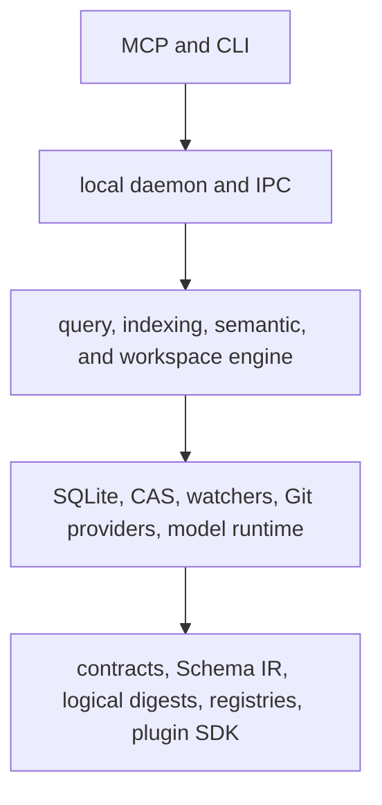

# Urdira

Urdira is a local, open-source code-intelligence engine for coding agents. It
indexes an explicitly selected workspace, keeps the index synchronized with the
working tree, and exposes deterministic structural, lexical, semantic, and
change-impact queries through MCP.

Urdira is a read-only intelligence layer. It does not edit source files, apply
patches, run shell commands, build projects, or infer repository scope from a
connection or current directory.

## Why Urdira

Coding agents often spend several turns finding a definition, its callers,
related tests, source context, and likely change impact. Urdira keeps those
facts in one snapshot-aware model so an agent can request a bounded context
package or compose dependent queries without repeatedly scanning the
repository.

Core properties:

- explicit workspace and snapshot scope on every source-reading request;
- immutable snapshots and persistent cursors, including after daemon restart;
- exact owner artifact, version, source span, evidence, and completeness data;
- near-real-time working-tree updates backed by authoritative reconciliation;
- changed-file watcher updates use a safe targeted capture when possible, with
  complete reconciliation retained as a fallback only for lost or ambiguous
  events;
- registered physical delete events are applied directly; renames publish the
  absence and new presence in consecutive generations;
- deterministic ordering with no hidden approximate fallback;
- concurrent workspaces, Git worktrees, detached checkouts, clones, ordinary
  directories, and read-only Git references; and
- a language-neutral core with a bundled JavaScript/TypeScript analyzer.

The bundled `urdira:javascript_typescript` plugin supports JavaScript,
TypeScript, JSX, TSX, and the surrounding module/type relationships. Other
languages require a compatible plugin. Without a structural plugin, source
catalog, text retrieval, snapshot, freshness, and index-status capabilities
remain available; unsupported operations fail explicitly.

## Install

Urdira 0.2.2 requires Node.js `>=24.18.1`. Confirmed runtime preparation also
requires npm `>=11.16.0`, which supplies the strict install-script policy. Check
with `npm --version`; if necessary, update the npm paired with the active Node
installation before preparing the runtime:

```bash
npm install --global npm@11.16.0
```

Install the dependency-free bootstrap:

```bash
npm install --global urdira
urdira --version
urdira --help
```

The bootstrap has no npm dependency closure, so the global installation does
not trigger native lifecycle scripts or transitive deprecation warnings.
Before the first real CLI or MCP command, review and prepare the exact matching
runtime:

```bash
urdira runtime prepare --dry-run
urdira runtime prepare --confirm
```

The dry-run names the target directory, fixed npm registry, exact runtime and
minimum npm versions, and the reviewed install scripts for ONNX Runtime, Sharp, Parcel
Watcher, and protobuf. It also discloses the current upstream
`boolean@3.2.0` deprecation inherited by Transformers.js. Preparation captures
that acknowledged npm notice, rejects any new warning, validates the installed
runtime, and activates it atomically. An interactive terminal offers the same
confirmation before its first runtime command; non-interactive and MCP starts
never install anything implicitly.

The first confirmed configuration that enables semantic search may download
the declared open embedding model. The CLI reports that action. Urdira does
not download models during startup, indexing, query execution, pagination, or
replay.

## Quick start

Preview registration before changing local Urdira state:

```bash
urdira workspace add /absolute/path/to/project
```

The CLI prints every detected technology, confidence, evidence path, and
compatible plugin before asking for confirmation. A workspace path is required;
use `.` for the current directory. To inspect the proposal without applying it, use:

```bash
urdira workspace add /absolute/path/to/project --dry-run
urdira status --json
urdira index --json
```

After an interactive registration succeeds, Urdira asks which coding-agent
integrations to install. Answer `yes`/`all` for every supported installer, or
enter a comma-separated subset: `claude-code`, `codex`, `opencode`, `cursor`,
`vscode`/`copilot`, `cline`, `roo`, and `claude-desktop`. Answer `no` to skip
this optional step. The prompt explicitly accepts `yes`, `all`, a comma-separated
client list, or `no`; the non-interactive `--confirm` path does not modify agent
configuration; use `urdira agent install --client <name> --confirm` (and
`--workspace /path` for a Roo project configuration) when you want to configure
one explicitly.

Destructive administrative commands use a preview/confirmation contract.
Removing a workspace leaves a recoverable tombstone for 24 hours. A later
`urdira workspace purge <workspaceId> --confirm` is refused while a
snapshot lease, pin, query, candidate, recovery operation, backup, migration,
or cross-workspace reference still needs its database.

Daemon start and shutdown are direct; neither needs `--dry-run` or `--confirm`:

```bash
urdira daemon start
urdira daemon stop
```

`daemon start` launches a per-user background process and reports the
`locking`, `catalog_verification`, `workspace_recovery`,
`provider_reconciliation`, and `ready` phases as they happen. Persistent
process output is written to `~/.urdira/daemon.log`. `daemon stop` returns
`already_stopped` when no daemon is running.

For a diagnostic run, append `--debug-timing` to the command (most commonly
`urdira daemon start --debug-timing`). This enables scan, plugin-analysis,
CAS, SQLite, and publication timing lines in the daemon log and propagates the
switch to SQLite worker threads. Timing output is opt-in and disabled by
default; restart an already-running daemon with the flag before collecting a
new timing sample.

For storage tuning, `URDIRA_CAS_PUT_CONCURRENCY` bounds independent CAS writes
per source-ingestion batch (default `16`). It is a scheduling knob only; each
blob keeps the same fsync and atomic-install durability boundary.

### MCP configuration

Urdira exposes one local stdio MCP server. The process starts or shares the
per-user daemon; workspace scope stays in tool arguments and is never stored as
connection state. Most MCP clients use this entry:

```json
{
  "mcpServers": {
    "urdira": {
      "command": "urdira",
      "args": ["mcp"]
    }
  }
}
```

#### Cursor

For Cursor, save the entry above in `.cursor/mcp.json` at the project root, or
in `~/.cursor/mcp.json` to make it available to every project. Then enable the
server from Cursor's MCP settings. Cursor Agent CLI reads the same files, so no
second installation is needed. See the [Cursor MCP documentation](https://docs.cursor.com/context/model-context-protocol).

#### VS Code and GitHub Copilot

VS Code uses a different top-level key. Create `.vscode/mcp.json` in the
workspace (or add the server from the user profile) with:

```json
{
  "servers": {
    "urdira": {
      "type": "stdio",
      "command": "urdira",
      "args": ["mcp"]
    }
  }
}
```

Open Chat and trust the local server when VS Code asks. The same configuration
is available to GitHub Copilot Chat. For a one-command setup, use
`urdira agent install --client vscode --confirm`; it installs the native
Copilot/VS Code hook as well. See [VS Code MCP server configuration](https://code.visualstudio.com/docs/agent-customization/mcp-servers).

#### Cline and Roo Code

Both extensions support local stdio MCP servers. `urdira agent install`
configures Cline's `cline_mcp_settings.json` and Roo Code's `.roo/mcp.json`
directly (Roo uses the workspace passed to `workspace add`). See the [Cline MCP guide](https://github.com/cline/cline/blob/main/docs/mcp/mcp-overview.mdx)
and [Roo Code MCP guide](https://roocodeinc.github.io/Roo-Code/features/mcp/using-mcp-in-roo/).

#### Claude Desktop

`urdira agent install --client claude-desktop --confirm` writes the supported
per-user Claude Desktop local-server configuration for the current OS. The
command is still `urdira mcp`; Claude Desktop does not need a separate Urdira
package. See [Claude's local MCP server guide](https://support.claude.com/en/articles/10949351-getting-started-with-local-mcp-servers-on-claude-desktop).

The MCP integration is available to all of these clients. The optional
`urdira agent install` search bridge is a separate native optimization. It
translates supported lexical, file-discovery, and semantic calls to Urdira and always
falls back to the client's native tool when the request cannot be translated or
the index is not current:

| Client | Urdira MCP | Native `urdira agent` bridge |
|---|---:|---:|
| Cursor / Cursor Agent CLI | Yes | Yes |
| VS Code / GitHub Copilot | Yes | Yes |
| Cline | Yes | No |
| Roo Code | Yes | No |
| Claude Desktop | Yes | No |
| Claude Code | Yes | Yes |
| Codex | Yes | Yes |
| OpenCode | Yes | Yes |

All integrations are opt-in and idempotent. The same command writes the
native hook or MCP configuration appropriate for the selected client:

```bash
urdira agent install --client claude-code --confirm
urdira agent install --client codex --confirm
urdira agent install --client opencode --confirm
urdira agent install --client cursor --confirm
urdira agent install --client vscode --confirm
urdira agent install --client cline --confirm
urdira agent install --client roo --workspace /absolute/path/to/project --confirm
urdira agent install --client claude-desktop --confirm
```

Cursor uses its user-level `~/.cursor/hooks.json` and its `preToolUse` hook to
bridge `Grep`, `Search Files`, and `Codebase` to Urdira's lexical, artifact, and
semantic lanes respectively. If a lane is unavailable, incomplete, or the
request is unsupported, the hook allows Cursor's native tool to run; it never
approximates semantic search as lexical search. See the [Cursor hooks documentation](https://docs.cursor.com/hooks).
VS Code/Copilot uses the user-level `~/.copilot/hooks/urdira.json` and the same
fail-open behavior. Cline, Roo Code, and Claude Desktop receive their local
`mcpServers.urdira` entry from the installer; they do not require copying JSON
by hand.

### Public MCP tools

| Tool | Purpose |
|---|---|
| `urdira_index_status` | Discover registered workspaces and inspect freshness, snapshots, capabilities, plugins, and indexing issues. |
| `urdira_query` | Run a direct operation, typed pipeline, registered recipe, or cursor continuation. |
| `urdira_context` | Execute the registered context recipe for a complete coding task in one call. |
| `urdira_analyze_change` | Analyze a hypothetical delete, rename, move, signature, type, visibility, contract, or behavior change. |
| `urdira_build_context` | Build one bounded evidence-aware context package for a coding task. |

The query surface includes definition and artifact discovery, symbol
resolution, outlines, references, graph expansion and paths, literal and safe
regex search, semantic and hybrid search, source retrieval, related tests,
architecture inspection, workspace comparison, impact analysis, context
construction, and frozen index status. See the
[public query contract](docs/protocol/public-query-contract.md) and
[MCP adapter contract](docs/protocol/mcp-adapter-contract.md).

Agents should first call `urdira_index_status` with the exact workspace root,
then repeat the returned `workspaceId` on every source-reading request. A
returned cursor is opaque and must be continued with the same scope.

For a multi-step coding task, prefer `urdira_context` or an API v3 pipeline
with explicit stage bindings. Dependent stages execute inside one snapshot and
one MCP request; freshness and the required readiness frontier are requested
with that same query instead of a readiness-polling loop. The complete-context
wrapper waits for the structural frontier by default (30 seconds unless an
explicit freshness policy is supplied); source-safe operations remain usable
at `source_ready` while later stages continue in the background.

## Benchmark evidence

Two frozen Vite campaigns compare ordinary repository tools,
codebase-memory MCP, and Urdira MCP using the same model, commit, task protocol,
and grader in each campaign. Estimated cost uses a fixed planning price card;
it is not a provider invoice.

### Localized implementation task

The main campaign ran 10 cold and 10 warm samples per arm after a six-run smoke
gate: 60/60 graded runs succeeded against Vite commit
`c0f2fc607ee97ee4499337b04826420c00654065`, Node `v24.18.1`, and model
`gpt-5.6-luna`.

| Arm | Success | Median time | Median tokens | Median estimated cost |
|---|---:|---:|---:|---:|
| Baseline | 20/20 | 317 s | 5.01 M | $10.29 |
| Codebase-memory MCP | 20/20 | 335 s | 8.75 M | $17.75 |
| Urdira MCP | 20/20 | 316 s | 4.02 M | $8.27 |

Urdira used 19.8% fewer median tokens and 19.6% lower median estimated cost
than baseline, with comparable elapsed time. Eleven Urdira host logs contained
non-fatal indexing/projection diagnostics; task grading still succeeded in
every run. See the [report](release/benchmarks/vite-agent-benchmark-results-2026-08-19.md),
[JSON summary](release/benchmarks/vite-agent-benchmark-results-2026-08-19.json),
and [protocol](release/benchmarks/vite-agent-benchmark.md).

### Cross-cutting lifecycle-map task

The independent broad-discovery battery completed 11/12 graded runs; one
codebase-memory warm report missed the required evidence count.

| Arm | Success | Median time | Median tokens | Median estimated cost |
|---|---:|---:|---:|---:|
| Baseline | 4/4 | 396 s | 5.19 M | $10.63 |
| Codebase-memory MCP | 3/4 | 379 s | 6.05 M | $12.36 |
| Urdira MCP | 4/4 | 363 s | 4.19 M | $8.63 |

These campaigns measure two specific Vite workloads, not a universal ranking.
The localized task favors precise nearby discovery; the lifecycle task favors
broad caller mapping. Raw audits and transcripts contain host-local paths and
are retained outside the public repository; committed reports bind them by
SHA-256 digest. See the [lifecycle report](release/benchmarks/vite-agent-lifecycle-map-results-2026-08-19.md),
[JSON summary](release/benchmarks/vite-agent-lifecycle-map-results-2026-08-19.json),
and [protocol](release/benchmarks/vite-agent-lifecycle-map-benchmark.md).

### Expanded TypeScript corpus

The expanded campaign covers four frozen GitHub repositories—TypeScript,
Playwright, Prisma, and VS Code—with two implementation tasks per repository
and four arms: baseline, Urdira with the JavaScript/TypeScript engine,
codebase-memory MCP, and CodeGraph. The 2026-08-24 comparison reran only Urdira
on Node `v24.18.1`; the 24 baseline, codebase-memory, and CodeGraph rows are
unchanged reused results from the prior audited comparison and are explicitly
marked as not re-executed.

| Arm | Correct | Median total time | Median tokens | Median estimated cost | Discovery MCP passed |
|---|---:|---:|---:|---:|---:|
| Baseline | 6/8 | 172.2 s | 2.06 M | $4.27 | n/a |
| Urdira TypeScript v3 | 8/8 | 369.4 s | 2.00 M | $4.08 | 206/211 |
| Codebase-memory MCP | 6/8 | 212.6 s | 4.01 M | $8.20 | historical metric unavailable |
| CodeGraph | 7/8 | 259.5 s | 2.67 M | $5.61 | historical metric unavailable |

Urdira reached the benchmark readiness boundary in every repository, from
30.7 s for TypeScript to 316.2 s for VS Code. The VS Code cells peaked at
4,921,168 and 4,804,240 KiB RSS, below the 5,000,000 KiB guard. Relative to the
2026-08-23 Urdira rerun, median total time fell from 504.8 s to 369.4 s and
median token use from 2.41 M to 2.00 M.

The correctness and attribution result is more limited than the timing result.
All eight repository graders passed, but five of 211 discovery calls failed;
two were request-validation failures, and two cells used narrow native source
inspection after an MCP failure. There were no IPC timeouts or
incomplete-coverage responses. Because the graded changes cannot all be
attributed to successful Urdira retrieval, this rerun does not support a claim
that Urdira is a code-intelligence replacement under this protocol. It is also
one sample per cell, not a P95 result.

The campaign also records missing repository dependencies such as `vitest` or
Playwright build artifacts; these do not turn a grader result into a test-pass
claim. Setup time, per-run tokens, estimated cost, MCP failure counts,
correctness evidence, readiness, and both provenance digests are in the
[expanded JSON report](release/benchmarks/expanded-typescript-agent-benchmark-results-2026-08-24.json)
and [expanded Markdown report](release/benchmarks/expanded-typescript-agent-benchmark-results-2026-08-24.md),
with the [benchmark corpus and task contract](release/benchmarks/expanded-typescript-agent-benchmark.json).
The combined 32-cell gate remains false because five reused comparison rows
failed their graders. P95 fields remain ineligible until three independent
campaigns are explicitly supplied.

These agent campaigns are comparative product evidence. Stable release
qualification additionally requires the correctness, crash, corruption,
security, stress, deterministic replay, and three-run P95 gates in the
[release policy](docs/decisions/08-performance-reliability-evaluation.md).

Urdira v3's indexing hot path uses native `Uint8Array` streams, transferable
worker buffers, and typed relational SQLite projections. Schema IR generates
the relational table metadata. Cross-process providers, plugins, daemon/CLI,
and explicit portable import/export use bounded Protobuf-ES chunks; JSON is
limited to configuration and MCP text/opaque references. Boundary telemetry
records bytes read, transferred, copied, decoded, and retained.

## Current limitations

- The bundled production structural analyzer is JavaScript/TypeScript only.
- Urdira is local and single-user; there is no network MCP or hosted service.
- Supported filesystems must provide reliable locking, atomic rename, durable
  sync, and SQLite WAL behavior.
- Semantic search depends on the configured local model being present and
  healthy. Structural and textual capabilities remain available if it is not.
- The npm distribution supplies JavaScript and host-selected native
  dependencies; it does not bundle Node.js. Deterministic platform archives
  are a separate offline distribution.

## Development

This is a strict TypeScript ESM workspace using pnpm `11.20.0` and Node
`>=24.18.1`.

```bash
corepack enable
pnpm install --frozen-lockfile
pnpm preflight:windows
pnpm verify
pnpm audit --prod
pnpm package:npm:smoke
pnpm package:release
pnpm release:acceptance
```

`pnpm verify` checks architecture boundaries, lint, the complete test suite,
coverage and critical branch thresholds, typechecking, generated-contract
consistency, documentation links, local-path leaks, and public-repository
hygiene. Release steps and external prerequisites are documented in
[docs/release.md](docs/release.md).

`pnpm preflight:windows` is the focused cross-platform gate for portable
filenames, a real staged-file round trip, Windows path and IPC adapters,
CRLF-sensitive Git fixtures, storage path decoding, and publication hygiene.

The production package graph is the dependency-free `urdira` bootstrap,
`@urdira/runtime`, and its public `@urdira/*` dependency closure.
`@urdira/testkit`, fixtures, source, development configuration, benchmark raw
transcripts, and historical implementation plans are excluded from published
packages.

## Architecture and documentation



Start with the [documentation guide](docs/README.md), the
[current architecture and operation graphs](docs/architecture.md), and the
[product foundation](docs/product-foundation.md). Approved decisions and their
linked protocols, registries, and serialization contracts are normative;
audits, release evidence, and benchmark reports are evidence only.

Contributions must preserve explicit scope, read-only public behavior,
deterministic results, source provenance, immutable pagination, and the package
dependency direction in [architecture/manifest.json](architecture/manifest.json).
Read [CONTRIBUTING.md](CONTRIBUTING.md) and [AGENTS.md](AGENTS.md), then run
`pnpm verify` before handoff.

## Security and license

See [SECURITY.md](SECURITY.md) for reporting and support policy. Urdira is
released under the [MIT License](LICENSE).
