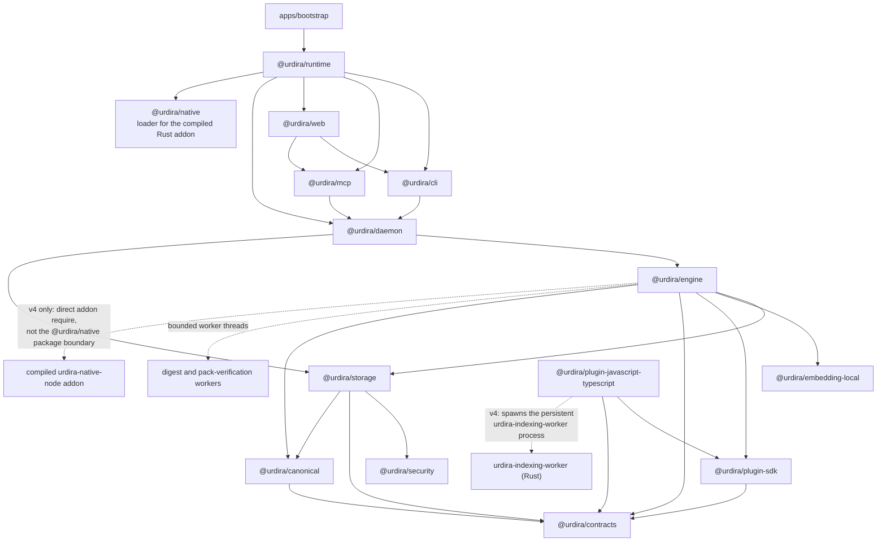
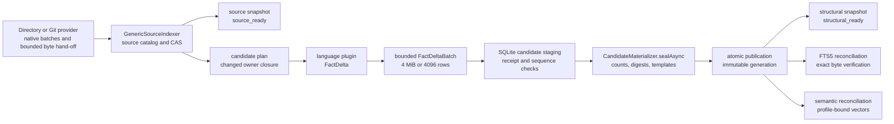
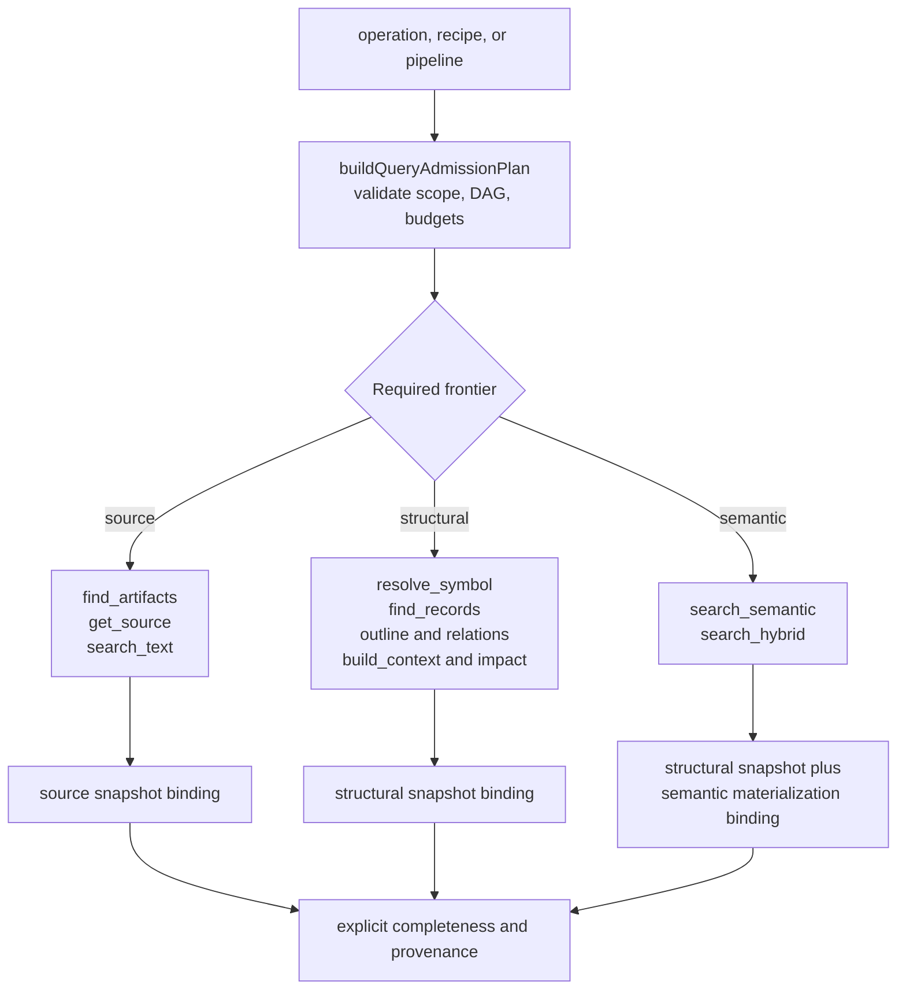
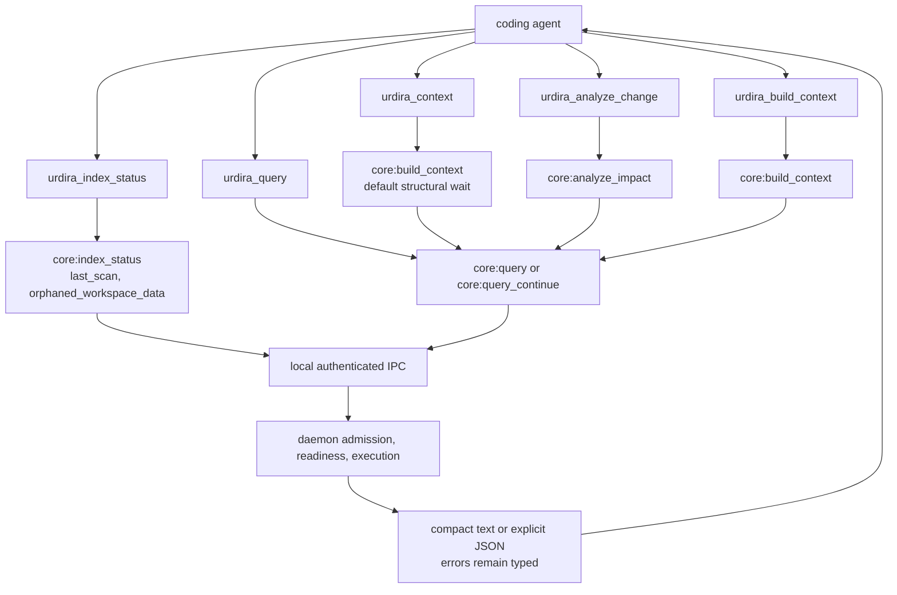

# Current architecture

Status: Implemented, v4 structural store (default) with v3 retained as an
opt-out legacy path (`URDIRA_V4=0`, see [docs/versioning.md](versioning.md))

Last updated: 2026-09-09

This guide is the implementation map for the current Urdira codebase. It does
not introduce product behavior: the linked decisions and protocols remain
normative. Use it to understand how a public request reaches the storage and
indexing components, then follow the code landmarks at the end of the
document.

The system has four invariants that explain most design choices:

- every source-reading operation names an explicit workspace and immutable
  snapshot binding;
- indexing publishes immutable generations atomically, while source,
  structural, and semantic readiness may advance independently;
- query stages exchange bounded, sealed sets rather than retaining another
  in-memory copy of the indexed corpus; and
- every performance shortcut has the same verified result and an explicit
  fallback to the authoritative synchronous or from-source path.

A newly registered workspace gets the v4 format by default
(`isV4Enabled()`, `packages/daemon/src/runtime.ts`); an existing v3 workspace
keeps working as v3 with no automatic migration. Both formats share the same
public query surface, MCP tools, and daemon/CLI lifecycle commands described
below; where their internals differ, this document says so explicitly.

## Package and dependency direction

Dependencies flow downward through the layers in
[`architecture/manifest.json`](../architecture/manifest.json). Public adapters
do not reach around the engine into storage, and plugins contribute validated
facts rather than defining public operations.

## v4 scan pipeline: catalog, analyze, materialize, publish

The v4 route replaces the per-generation TypeScript/SQLite composition
described further below with a persistent Rust worker process
(`urdira-indexing-worker`, spawned and supervised from
`packages/plugin-javascript-typescript/src/worker.ts`) that owns one
workspace's structural store end to end. Its own `v4/scan.rs` module
describes the pipeline as: **catalog -> parse/semantics -> facts ->
materialize -> write -> Merkle -> snapshot -> events**, driven by three scan
scopes carried over the worker JSON-RPC protocol
(`crates/urdira-worker-protocol/src/lib.rs`): `Full` (from-scratch walk),
`Changed` (an exact caller-supplied path set, for watcher-driven incremental
scans), and `Reconcile` (below).

```mermaid
flowchart LR
  Walk["urdira-source-frontier\nwalk, hash, CAS, source-state digest"] --> Catalog["v4/catalog.rs\nsource catalog delta into SQLite"]
  Catalog --> Analyze["v4/analyze.rs + typeflow.rs\nurdira-jsts-syntax-worker, urdira-jsts-typeflow"]
  Analyze --> Deps["v4/deps.rs\ndependency and reference closure"]
  Deps --> Materialize["v4/materialize.rs\nrecord and dependency rows"]
  Materialize --> Write["urdira-structural-store\nimmutable mmap segments"]
  Write --> Merkle["merkle_bucket.rs\nper-segment Merkle digests"]
  Merkle --> Snapshot["atomic current-pointer swap"]
  Snapshot --> Events["IndexingEvent stream\nScanCompleted / Queryable"]
  Events -. "background, off the scan critical path" .-> Residual["v4/residual.rs\nurdira-tsgo-client ResidualPass"]
```

Only JavaScript/TypeScript source ever reaches `analyze`; the pipeline itself
is language-neutral at the catalog/materialize/publish/store layer, with the
JS/TS engine (`urdira-jsts-indexing-engine`, `urdira-jsts-syntax-worker`,
`urdira-jsts-native-projection`) as the one bundled language authority.

### Reconcile: catching up after a git operation the watcher could not track

A filesystem watcher cannot safely interpret a `git checkout`, `git pull`, a
worktree branch switch, or a burst of coalesced/overflowed OS filesystem
events as a precise changed-file list. `packages/engine/src/watchers.ts` and
`reconciliation.ts` classify those situations as one of
`WatcherReconcileReason`: `branch_changed`, `events_lost`, or
`provider_reset`, and request a `ScanScope::Reconcile` scan instead of
guessing a `Changed` path list.

`run_reconcile` (`crates/urdira-indexing-worker/src/v4/scan.rs`) always
re-derives the delta from one authoritative walk — the same walk `Full`
performs — then chooses which pipeline republishes it:

- **equivalence by content hash**: a path whose content hash and byte length
  are unchanged from the current frontier (a touched file, a `git stash`, an
  index-pack import onto a fresh filesystem) is reported separately from
  `added`/`changed`/`deleted` and never opens a new artifact version;
- if the authoritative `added + changed + deleted` count is at most
  `RECONCILE_DELTA_THRESHOLD` (`0.01`, overridable with
  `URDIRA_V4_RECONCILE_THRESHOLD`) of the current frontier size, it republishes
  through the cheaper `Changed`/delta pipeline (`ReconcileMode::Delta`);
  otherwise, or if that delta pipeline fails, it republishes through the
  `Full` pipeline instead (`ReconcileMode::Cold`, with `fell_back_to_cold:
  true` in the failure case);
- an empty authoritative delta publishes nothing and reports
  `ReconcileMode::Noop`.

`core:index_status` exposes the outcome of the most recent v4 scan as
`last_scan` (omitted entirely for v3 workspaces), which carries a
`reconcile` object — `mode`, `added`/`changed`/`deleted`, `frontier_size`,
the effective `threshold`, and `fell_back_to_cold` — only when that scan's
`kind` was `"reconcile"`. `core:reindex` always forces `scope: "full"`,
bypassing reconcile's delta measurement entirely.

### Residual pass: closing the gap typeflow's local resolver cannot

`v4/typeflow.rs` builds and incrementally maintains a `ProgramIndex`
(`urdira-jsts-typeflow`) unconditionally on every v4 scan, resolving as many
member-access and heritage relationships as pure declared-type/lexical
information allows. What typeflow cannot resolve locally is emitted as a
`possible` (not `confirmed`) `core:call`/`core:inherits`/`core:implements` row
against one or more candidates, with `pending.sites` recording the open
question.

`v4/residual.rs` runs a background pass, outside the critical path of any
scan, that spawns the pinned `tsgo` (TypeScript 7) binary through
`urdira-tsgo-client`'s JSON-RPC `--api --async` mode (decision 28,
[`docs/decisions/28-v4-rust-semantics-and-residual-checker.md`](decisions/28-v4-rust-semantics-and-residual-checker.md))
to run a real `ts.Program`/checker over the whole project and upgrade
resolvable `possible` rows to `confirmed`. `core:references` and similar
operations can therefore return `possible` results with a candidate list
before the residual pass completes, and `confirmed` afterward, without
changing the request shape.

### Structural store and identity pushdown

`urdira-structural-store` is the v4 production structural store: an
immutable-per-segment, mmap-served, fixed-width-array store for structural
records and artifact dependencies, with append-only segment writes and a
Merkle digest per segment (used for the delta/cold equivalence check above
and for cross-workspace/donor verification). The compiled addon
(`crates/urdira-native-node`, `structural_store_napi.rs`) exposes a
`NativeStructuralStoreHandle` that `packages/engine/src/native-structural-store-binding.ts`
loads directly (a raw `require()` of the built `.node` file, bypassing the
`@urdira/native` package boundary that governs the shipped, checksummed
addon used elsewhere). Query operations that can be expressed as an index
lookup over that store — `records_by_identity_ids`/`records_by_identity_keys`,
`by_kind_universal`, and the full catalog of pushdown-eligible operations
below — run natively in one call instead of a JavaScript scan over
deserialized rows; a selector shape the native store has no dedicated index
for is rejected outright (`core:selector_unresolvable`) rather than served by
an O(corpus) linear scan.

### Lexical and semantic sidecars

Both formats keep lexical (full-text/trigram) and semantic (vector) search in
separate SQLite sidecar databases attached alongside the workspace's main
catalog connection, reconciled asynchronously after structural publication —
queries never wait on either sidecar to answer a structural request.

- **Lexical**: `packages/engine/src/lexical-reconciler.ts` maintains the FTS5
  trigram index; v4 additionally supports an opt-in Rust-owned lexical build
  (`lexical_owned_by_rust`) that pushes the reconciliation work into the
  native layer.
- **Semantic**: `packages/daemon/src/semantic-v4-wiring.ts` ATTACHes the
  semantic sidecar directly onto the workspace's own catalog connection and
  builds a native-backed entity record source
  (`packages/engine/src/semantic-entity-source-v4.ts`). The sidecar tracks
  per-document state (`semantic_document_status`), a coverage summary
  (`semantic_coverage_summary`), and a segment cache
  (`semantic_segment_cache`); a document is split into token-bounded segments
  (256 tokens, 32-token overlap, capped at `MAX_SEGMENTS` per document) and
  embedded per entity segment rather than per whole file. Maintenance runs on
  a worker thread (`URDIRA_SEMANTIC_WORKERS` bounds its concurrency) so status
  RPCs stay responsive during a full embedding pass. `core:semantic_affected_page`
  pages through documents a materialization pass has not yet covered, keyed
  by an `affected_artifact_set_id`; `core:affected_set_stale` is returned
  instead of a mixed/partial page when that set no longer matches the
  workspace's current affected documents. See
  [docs/semantic/core-semantic-reasons.md](semantic/core-semantic-reasons.md)
  and [decision 16](decisions/16-semantic-search-wiring.md).

## v3 legacy pipeline (`URDIRA_V4=0`)

A v3 workspace still runs the per-generation TypeScript-orchestrated pipeline
this document previously described exclusively. `runFullWorkspaceScan`
(`packages/engine/src/workspace-indexing-session.ts`) is the composition root
for one scan: it captures a stable source observation, updates the source
catalog, analyzes only the required artifact closure, accepts bounded
FactDelta batches from the same Rust syntax/semantic workers used at v4's
`analyze` stage, seals a candidate, and asks storage
(`packages/storage/src/publication-authority.ts`) to publish it atomically
into relational SQLite. `runProgressiveWorkspaceScan` reuses one prepared
source capture across ordered structural stages (syntax, resolution,
semantic-facts), each verifying its direct predecessor is still current
before publishing.

First-generation acceleration (local fork of a compatible donor, or an
explicit index pack) and the destructive, non-migrated `index_contract`
cutover between formats are unchanged from decisions 22/23/26-29; see
[docs/decisions/23-index-pack.md](decisions/23-index-pack.md) for the pack
carrier (v4's own `core:index_pack_export`/`workspace-add --index-pack` route
re-keys `workspace_id` and runs a `reconcile` scan after import rather than
reusing the v3 fork/copy machinery directly).

## Readiness and operation availability

Readiness is an operation requirement, not one global boolean, in both
formats. The admission plan derives the required frontier from the requested
operation or pipeline. With freshness mode `wait`, the daemon waits only up
to the declared timeout; otherwise it returns the registered stale/not-ready
error and the frontier that is missing.

Lexical search uses FTS5 trigram candidates (or the v4 Rust-owned lexical
build) only when the index is complete for the selected generation and always
verifies candidates against stored bytes. Otherwise it performs an exact
selected-scope scan and reports its freshness; approximate lexical results
are never returned.

## Query execution, bounded pipelines, and cursors

`QueryEngine.execute` normalizes the complete request before work begins,
identically for v3 and v4 workspaces. A direct operation goes through
`CanonicalRecordQueryDataPort`; a recipe expands to registered operations;
and a pipeline goes through `executePipeline`. Ready independent stages may
run concurrently, but a downstream stage observes only sealed upstream
handles. Final iterators are written to an immutable manifest in forward and
reverse order before the first page is returned. On a v4 workspace, an
eligible operation is served by a native pushdown call into the structural
store instead of a JavaScript scan; the emitted results, completeness, and
cursor behavior are unchanged either way.

```mermaid
flowchart LR
  Query["API v3 QueryRequest"] --> Normalize["normalizeQueryRequest\nclosed schema and plan digest"]
  Normalize --> Kind{Expression type}
  Kind -->|operation| Port["CanonicalRecordQueryDataPort"]
  Kind -->|recipe| Recipe["executeRecipe"]
  Kind -->|pipeline| Pipeline["executePipeline\nvalidated dependency DAG"]
  Recipe --> Port
  Pipeline --> Stages["source, expand, set, filter,\njoin, deduplicate, select"]
  Stages --> Spool["execution-scoped SQLite spool\nsealed StageSetHandle values"]
  Spool --> Port
  Port -->|v4 eligible operation| NativePushdown["native structural-store pushdown\n(identity indexes, by_kind_universal)"]
  Port -->|v3, or v4 fallback| Evaluation["streams, completeness, diagnostics"]
  NativePushdown --> Evaluation
  Evaluation --> Manifest["immutable forward and reverse manifest"]
  Manifest --> Page["bounded first page and signed cursor"]
  Cursor["continuation request"] --> Manifest
  Manifest --> Next["bounded next or previous page\nwithout rerunning the query"]
```

The execution spool is temporary and is deleted on success, failure, or
cancellation. Cursor continuations use the persisted manifest, pinned scope,
ordering digest, completeness report, and expiry; they never rerun or rerank
the original request.

## Public MCP operation paths

The MCP adapter exposes five read-only tools. All paths validate API v3 and
explicit scope before local IPC. The two convenience tools lower to registered
core operations, while `urdira_context` uses the same `core:build_context`
intent with a structural wait default. MCP formatting is a concise projection
of the public result and does not change query semantics; an opt-in,
hidden `snippet_lines` request field (0-3 lines, default 0) additionally
projects a bounded literal excerpt per matched source line.

The recommended agent sequence is to call `urdira_index_status` with the exact
workspace root, reuse the returned `workspace_id` in every source-reading
request, prefer `urdira_context` or a bound pipeline for multi-step tasks, and
continue opaque cursors with the same scope. Native source-reading tools are
not a substitute for an available Urdira operation when validating Urdira
itself.

## Workspace lifecycle: orphans and index packs (v4)

Removing a workspace leaves a recoverable tombstone; purging it can still
leave behind data outside the catalog's own bookkeeping (a structural
directory, a sidecar database) if a prior operation was interrupted.
`core:workspace_orphans_list`/`core:workspace_orphans_purge`
(`urdira workspace orphans [purge]`) detect and remove that residue; a
periodic sweep at daemon startup runs the same detection automatically
without aborting an in-progress semantic maintenance pass.

`core:index_pack_export`/`workspace-add --index-pack` (decision 23) both use
the v4 native structural store directly: export reports a deadline and
progress and completes in tens of seconds for a multi-million-record
workspace; import re-keys `workspace_id` for the destination and always runs
a `reconcile` scan afterward instead of trusting the pack's own frontier. See
[docs/evidence/2026-09-07-v4-vscode-campaign.md](evidence/2026-09-07-v4-vscode-campaign.md)
and [docs/evidence/2026-09-08-v4-daemon-robustness.md](evidence/2026-09-08-v4-daemon-robustness.md)
for measured export/import timings.

## Code landmarks

| Concern | Primary code | What to read there |
|---|---|---|
| v4 scan orchestration | `crates/urdira-indexing-worker/src/v4/scan.rs` | `run_full_scan`/`run_reconcile`: catalog -> parse/semantics -> facts -> materialize -> write -> Merkle -> snapshot -> events. |
| v4 source catalog | `crates/urdira-source-frontier` | Walk, hash, CAS, catalog delta into SQLite, source-state digest, in `O(delta)`. |
| v4 structural store | `crates/urdira-structural-store` | Immutable-per-segment, mmap-served, fixed-width-array store with append-only writes and per-segment Merkle digests. |
| v4 JS/TS engine | `crates/urdira-jsts-syntax-worker`, `urdira-jsts-native-projection`, `urdira-jsts-typeflow` | Persistent content-keyed syntax analysis, native observation projection, and the local declared-type/lexical resolver. |
| v4 residual checker | `crates/urdira-indexing-worker/src/v4/residual.rs`, `crates/urdira-tsgo-client` | Background `tsgo --api --async` pass that upgrades `possible` rows to `confirmed` outside the scan critical path. |
| Native addon and pushdown | `crates/urdira-native-node/src/structural_store_napi.rs`, `packages/engine/src/native-structural-store-binding.ts` | `NativeStructuralStoreHandle` and the identity/kind pushdown surface used by `CanonicalRecordQueryDataPort`. |
| Reconcile scope | `packages/engine/src/reconciliation.ts`, `watchers.ts`, `crates/urdira-indexing-worker/src/v4/scan.rs::run_reconcile` | Watcher reconcile reasons, `RECONCILE_DELTA_THRESHOLD`/`URDIRA_V4_RECONCILE_THRESHOLD`, delta-vs-cold republish decision. |
| Semantic v4 wiring | `packages/daemon/src/semantic-v4-wiring.ts`, `packages/engine/src/semantic-entity-source-v4.ts`, `semantic-reconciler.ts` | Sidecar attachment, per-document status/coverage, segment cache, worker-thread maintenance. |
| Workspace orphans | `packages/daemon/src/runtime.ts` (`core:workspace_orphans_list`/`_purge`), `packages/cli/src/index.ts` | Startup sweep and CLI subcommand for residual workspace data. |
| v3 scan composition | `packages/engine/src/workspace-indexing-session.ts` | `runFullWorkspaceScan`/`runProgressiveWorkspaceScan`, retained for `URDIRA_V4=0` workspaces. |
| Index pack bootstrap | `packages/engine/src/index-pack.ts`, `index-pack-verify-core.ts`, and `workspace-fork.ts` | Portable streaming carrier, untrusted verification, bounded copy, rollback, and scan fallback (v3 route; v4 uses its own native import path). |
| Atomic storage publication | `packages/storage/src/publication-authority.ts` | Bounded command streams, phase checkpoints, immutable-row assertions, and current-pointer swap (v3). |
| Query admission | `packages/engine/src/query-plan.ts` | API v3 normalization, stage dependency validation, operation versions, budgets, and plan digest. |
| Query lifecycle | `packages/engine/src/query-execution.ts` | `QueryEngine.execute` evaluates once, persists both manifest directions, pages, and cleans up the spool. |
| Pipeline execution | `packages/engine/src/pipeline-executor.ts` | `executePipeline` schedules ready frontiers and seals every output as a `StageSetHandle`. |
| Canonical operations | `packages/engine/src/canonical-query-data-port.ts` | `CanonicalRecordQueryDataPort` implements language-neutral operations with indexed pushdown (v4) and bounded fallback paths. |
| MCP surface | `packages/mcp/src/index.ts` | `createUrdiraToolDefinitions`, request lowering, IPC invocation, result dieting, and deterministic rendering. |
| Local web surface | `packages/web/src/server/index.ts` and `packages/web/src/client/main.tsx` | Authenticated loopback CLI API, Streamable HTTP MCP composition, directory-only selection, and the bundled browser interface. |
| Daemon orchestration | `packages/daemon/src/runtime.ts` and `scheduler.ts` | Workspace lifecycle, readiness barriers, scan scheduling, query cancellation, reconcile dispatch, and maintenance. |
| Physical schema (v3) | `packages/storage/src/schema.ts` and `packages/contracts/src/relational-schema.ts` | SQLite DDL derived from Schema IR and the v3 contract marker (`0x33`). |
| Logical digests | `packages/canonical/src/logical-digest-writer.ts` | Incremental field, presence, type, length, sequence, and canonical-set framing. |

For normative detail, read [Decision 04](decisions/04-workspace-snapshot-incremental-indexing.md),
[Decision 05](decisions/05-storage-projection-architecture.md),
[Decision 20](decisions/20-source-first-readiness.md),
[Decision 21](decisions/21-native-pipeline-relational-storage.md),
[Decision 22](decisions/22-v3-optimization.md),
[Decision 23](decisions/23-index-pack.md), [Decision 24](decisions/24-local-web-interface.md),
[Decision 26 through 29](decisions/26-v4-structural-store.md) for the v4
structural store, semantics, and scan pipeline, and the
[public query contract](protocol/public-query-contract.md).
