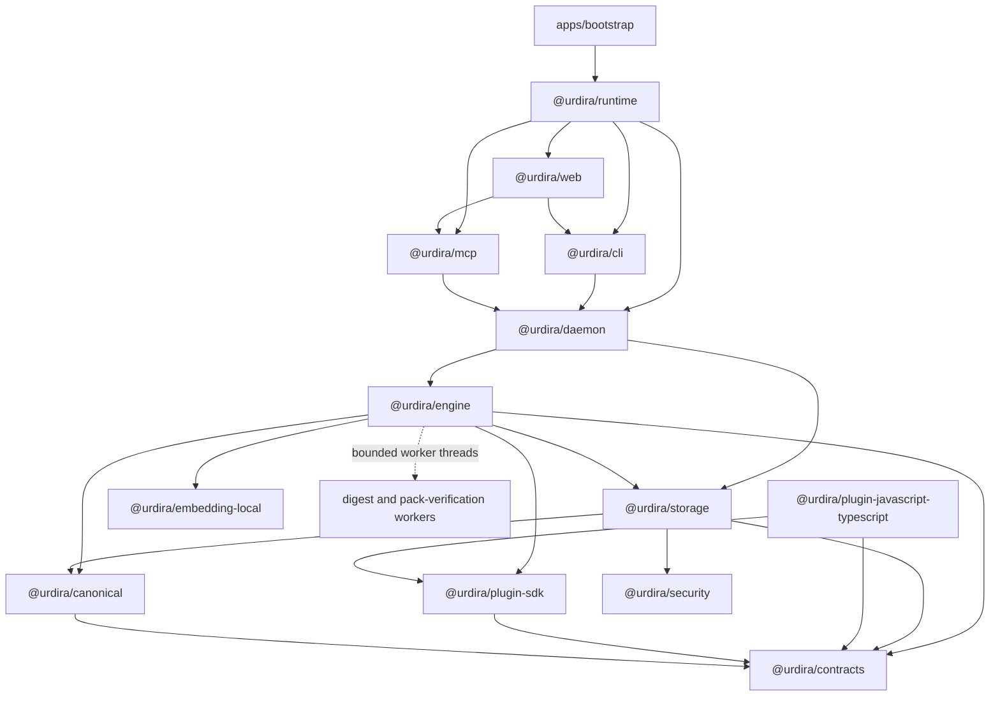
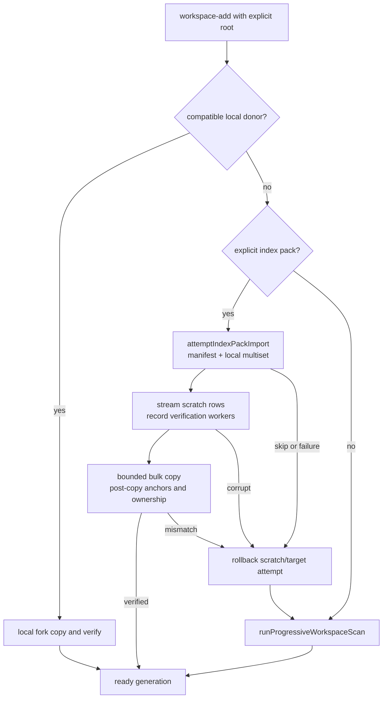
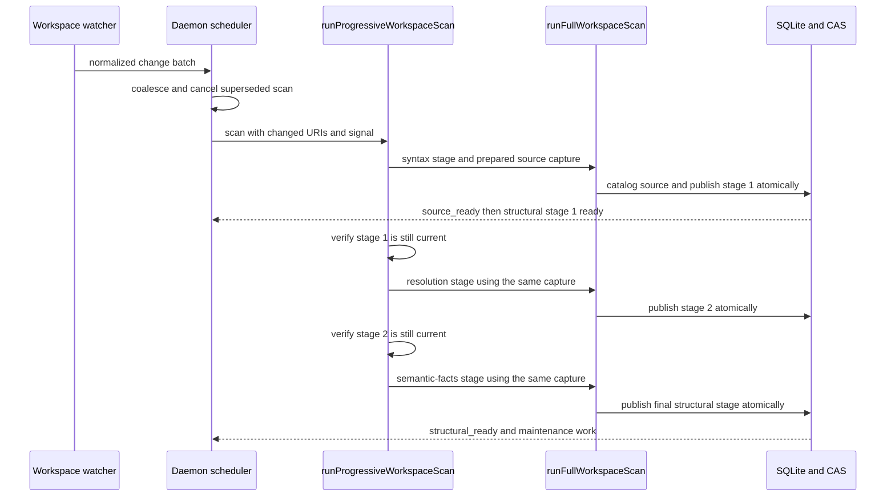
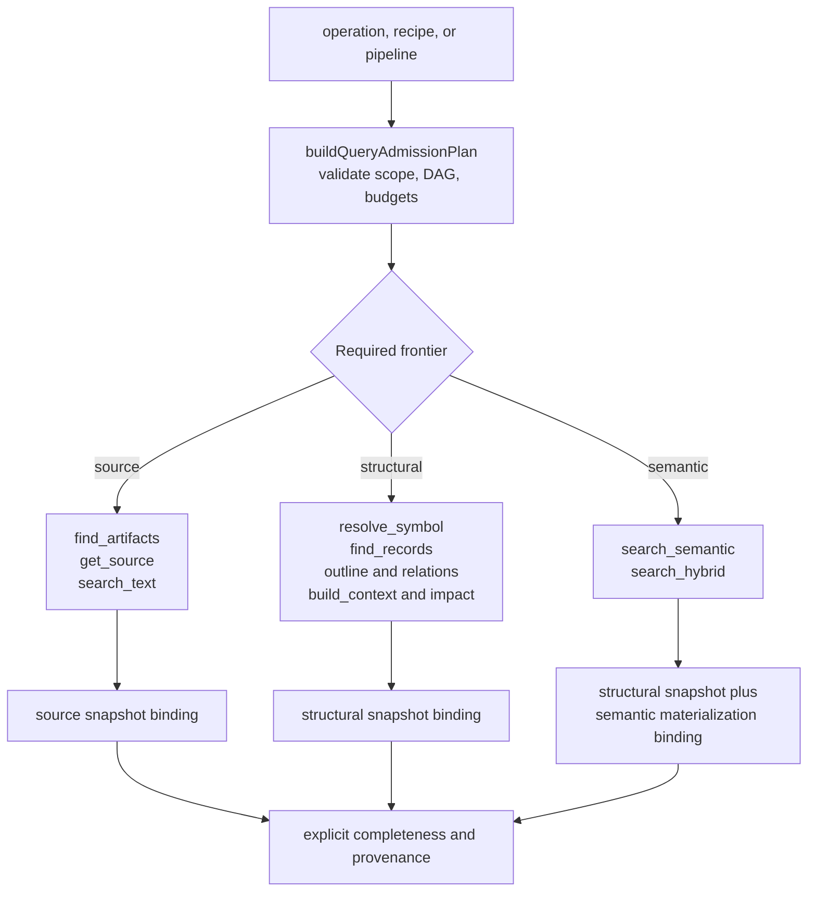
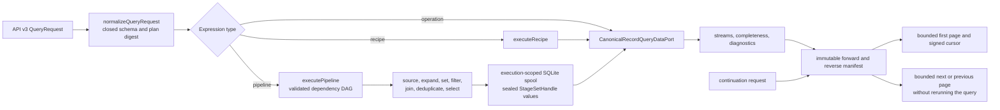
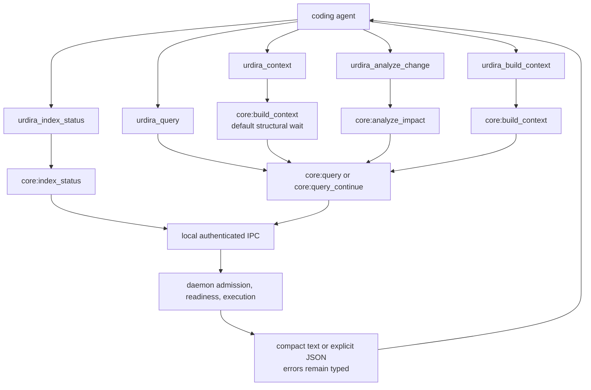

# Current architecture

Status: Implemented Urdira v3 architecture

Last updated: 2026-08-24

This guide is the implementation map for the current Urdira v3 codebase. It
does not introduce product behavior: the linked decisions and protocols remain
normative. Use it to understand how a public request reaches the storage and
indexing components, then follow the code landmarks at the end of the document.

The system has three invariants that explain most design choices:

- every source-reading operation names an explicit workspace and immutable
  snapshot binding;
- indexing publishes immutable generations atomically, while source,
  structural, and semantic readiness may advance independently; and
- query stages exchange bounded, sealed sets rather than retaining another
  in-memory copy of the indexed corpus.
- every performance shortcut has the same verified result and an explicit
  fallback to the authoritative synchronous or from-source path.

## Package and dependency direction

Dependencies flow downward through the layers in
[`architecture/manifest.json`](../architecture/manifest.json). Public adapters
do not reach around the engine into storage, and plugins contribute validated
facts rather than defining public operations.

## Indexing from bytes to an immutable snapshot

`runFullWorkspaceScan` is the composition root for one scan. It captures a
stable source observation, updates the source catalog, analyzes only the
required artifact closure, accepts bounded FactDelta batches, seals a
candidate, and asks storage to publish it atomically. The directory provider's
bounded prefetch hand-off lets cataloging consume the bytes already captured by
native enumeration. Native plugin workers then read immutable CAS references;
JSON is not a persistence or digest representation.

```mermaid
flowchart LR
  Observe["Directory or Git provider\nnative batches and bounded byte hand-off"] --> Catalog["GenericSourceIndexer\nsource catalog and CAS"]
  Catalog --> SourceReady["source snapshot\nsource_ready"]
  Catalog --> Plan["candidate plan\nchanged owner closure"]
  Plan --> Analyze["language plugin\nFactDelta"]
  Analyze --> Batch["bounded FactDeltaBatch\n4 MiB or 4096 rows"]
  Analyze -. "compacted record strings" .-> RecordDigests["MaterializationRecordDigestPipeline\none bounded worker"]
  Batch --> Stage["SQLite candidate staging\nreceipt and sequence checks"]
  Batch --> Accumulate["record template accumulator"]
  RecordDigests --> Accumulate
  Stage --> Seal["CandidateMaterializer.sealAsync\ncounts, digests, templates"]
  Accumulate --> Seal
  Seal -. "two corpus-scale ordered sets" .-> SealWorkers["MaterializationDigestOffload\nbounded workers or sync fallback"]
  SealWorkers --> Publish
  Seal --> Publish["atomic publication\nimmutable generation"]
  Publish --> StructuralReady["structural snapshot\nstructural_ready"]
  Publish --> Lexical["FTS5 reconciliation\nexact byte verification"]
  Publish --> Semantic["semantic reconciliation\nprofile-bound vectors"]
```

The source catalog is durable before structural analysis begins. If a process
stops between cataloging and publication, the next scan reconstructs its base
from the last actually published generation and republishes the uncommitted
source transition; it never mistakes the catalog's newest row for published
structural state.

The digest workers are scheduling optimizations, not authorities. The record
pipeline returns only successful batches to the accumulator; every skipped or
failed batch is hashed synchronously. `sealAsync` similarly falls back to the
same in-process recipes. Count and digest checks still run before publication.

## First-generation acceleration and fallback

New workspaces keep one correctness path even when reuse is available. A local
fork reuses a verified donor inside the same installation. An explicitly
supplied index pack crosses a trust boundary, so `attemptIndexPackImport`
validates its manifest and local source multiset, verifies record bodies while
streaming into an isolated scratch database, then reuses the fork copy and
publication machinery. Any failure rolls back before the ordinary scan starts.

Pack export and import are defined by [Decision 23](decisions/23-index-pack.md).
The pack carrier is portable gzip/NDJSON, but imported knowledge becomes normal
relational/CAS state; queries never read from the pack itself.

## Watchers, reconciliation, and progressive publication

The daemon coalesces filesystem events and supersedes an older scan with a new
cancellation signal. A workspace whose first scan has not yet reached
`ready`/`degraded` stays protected from its own trailing initial watcher backlog,
even after an intermediate stage has published a snapshot.
`runProgressiveWorkspaceScan` reuses one prepared source capture across the
ordered plugin stages. Every stage checks that its direct predecessor is still
current before publishing, so a concurrent source change cannot append
structural facts to the wrong snapshot.

Equivalent rescans advance freshness without publishing an empty generation.
Unstable observations, invalid plugin output, stale bases, cancellation, and
resource exhaustion fail explicitly and leave the last published snapshot
readable.

## Readiness and operation availability

Readiness is an operation requirement, not one global boolean. The admission
plan derives the required frontier from the requested operation or pipeline.
With freshness mode `wait`, the daemon waits only up to the declared timeout;
otherwise it returns the registered stale/not-ready error and the frontier
that is missing.

Lexical search uses FTS5 trigram candidates only when the index is complete for
the selected generation and always verifies candidates against stored bytes.
Otherwise it performs an exact selected-scope scan and reports its freshness;
approximate lexical results are never returned.

## Query execution, bounded pipelines, and cursors

`QueryEngine.execute` normalizes the complete request before work begins. A
direct operation goes through `CanonicalRecordQueryDataPort`; a recipe expands
to registered operations; and a pipeline goes through `executePipeline`.
Ready independent stages may run concurrently, but a downstream stage observes
only sealed upstream handles. Final iterators are written to an immutable
manifest in forward and reverse order before the first page is returned.

The execution spool is temporary and is deleted on success, failure, or
cancellation. Cursor continuations use the persisted manifest, pinned scope,
ordering digest, completeness report, and expiry; they never rerun or rerank
the original request.

## Public MCP operation paths

The MCP adapter exposes five read-only tools. All paths validate API v3 and
explicit scope before local IPC. The two convenience tools lower to registered
core operations, while `urdira_context` uses the same `core:build_context`
intent with a structural wait default. MCP formatting is a concise projection
of the public result and does not change query semantics.

The recommended agent sequence is to call `urdira_index_status` with the exact
workspace root, reuse the returned `workspace_id` in every source-reading
request, prefer `urdira_context` or a bound pipeline for multi-step tasks, and
continue opaque cursors with the same scope. Native source-reading tools are
not a substitute for an available Urdira operation when validating Urdira
itself.

## Code landmarks

| Concern | Primary code | What to read there |
|---|---|---|
| Scan composition | `packages/engine/src/workspace-indexing-session.ts` | `runFullWorkspaceScan` documents the frozen base, source catalog, candidate, seal, and publish phases. `runProgressiveWorkspaceScan` owns ordered structural stages. |
| JavaScript/TypeScript extraction | `packages/plugin-javascript-typescript/src/analyzer.ts` | `analyzeProject` creates one immutable TypeScript project, `walkFiles` owns per-file extraction, and `assembleAnalysis` owns global covers, sorting, and dependency closures. Incremental sessions reuse the same two extraction phases. |
| Source catalog and CAS | `packages/engine/src/source-indexer.ts` | `GenericSourceIndexer` validates stable observations and commits source occurrences. |
| Candidate lifecycle | `packages/engine/src/candidate-indexer.ts` and `candidate-materialization.ts` | Candidate state transitions, replacement scopes, immutable templates, and sealing. |
| Digest scheduling | `packages/engine/src/materialization-record-digest-pipeline.ts` and `materialization-digest-offload.ts` | Fail-safe record-digest overlap, ordered-set worker offload, batching, and synchronous fallbacks. |
| Index pack bootstrap | `packages/engine/src/index-pack.ts`, `index-pack-verify-core.ts`, and `workspace-fork.ts` | Portable streaming carrier, untrusted verification, bounded copy, rollback, and scan fallback. |
| Atomic storage publication | `packages/storage/src/publication-authority.ts` | Bounded command streams, phase checkpoints, immutable-row assertions, and current-pointer swap. |
| Query admission | `packages/engine/src/query-plan.ts` | API v3 normalization, stage dependency validation, operation versions, budgets, and plan digest. |
| Query lifecycle | `packages/engine/src/query-execution.ts` | `QueryEngine.execute` evaluates once, persists both manifest directions, pages, and cleans up the spool. |
| Pipeline execution | `packages/engine/src/pipeline-executor.ts` | `executePipeline` schedules ready frontiers and seals every output as a `StageSetHandle`. |
| Canonical operations | `packages/engine/src/canonical-query-data-port.ts` | `CanonicalRecordQueryDataPort` implements language-neutral operations with indexed pushdown and bounded fallback paths. |
| MCP surface | `packages/mcp/src/index.ts` | `createUrdiraToolDefinitions`, request lowering, IPC invocation, result dieting, and deterministic rendering. |
| Local web surface | `packages/web/src/server/index.ts` and `packages/web/src/client/main.tsx` | Authenticated loopback CLI API, Streamable HTTP MCP composition, directory-only selection, and the bundled browser interface. |
| Daemon orchestration | `packages/daemon/src/runtime.ts` and `scheduler.ts` | Workspace lifecycle, readiness barriers, scan scheduling, query cancellation, and maintenance. |
| Physical schema | `packages/storage/src/schema.ts` and `packages/contracts/src/relational-schema.ts` | SQLite DDL derived from Schema IR and the destructive v3 contract marker. |
| Logical digests | `packages/canonical/src/logical-digest-writer.ts` | Incremental field, presence, type, length, sequence, and canonical-set framing. |

For normative detail, read [Decision 04](decisions/04-workspace-snapshot-incremental-indexing.md),
[Decision 05](decisions/05-storage-projection-architecture.md),
[Decision 20](decisions/20-source-first-readiness.md),
[Decision 21](decisions/21-native-pipeline-relational-storage.md),
[Decision 22](decisions/22-v3-optimization.md),
[Decision 23](decisions/23-index-pack.md), [Decision 24](decisions/24-local-web-interface.md), and the
[public query contract](protocol/public-query-contract.md).
